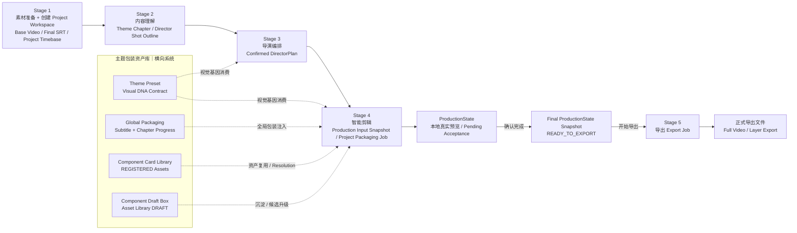
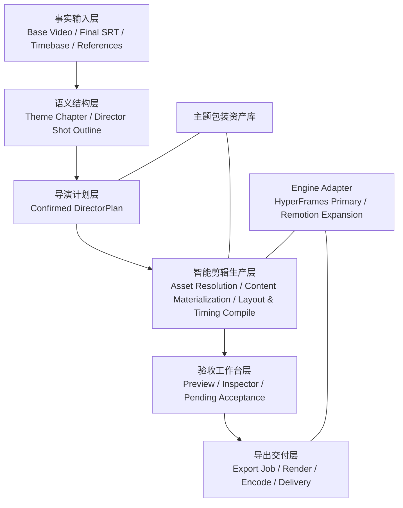
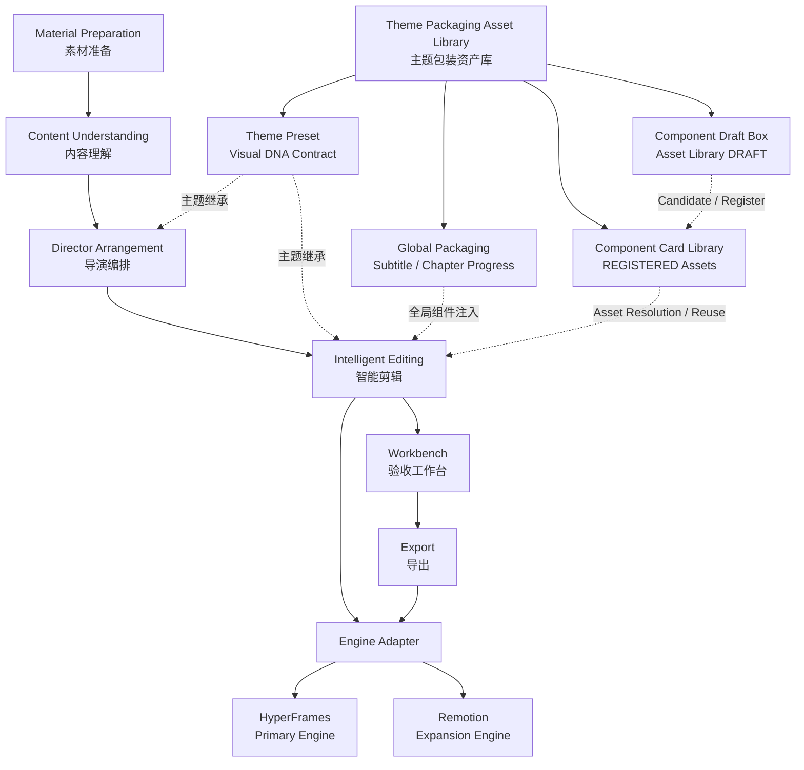
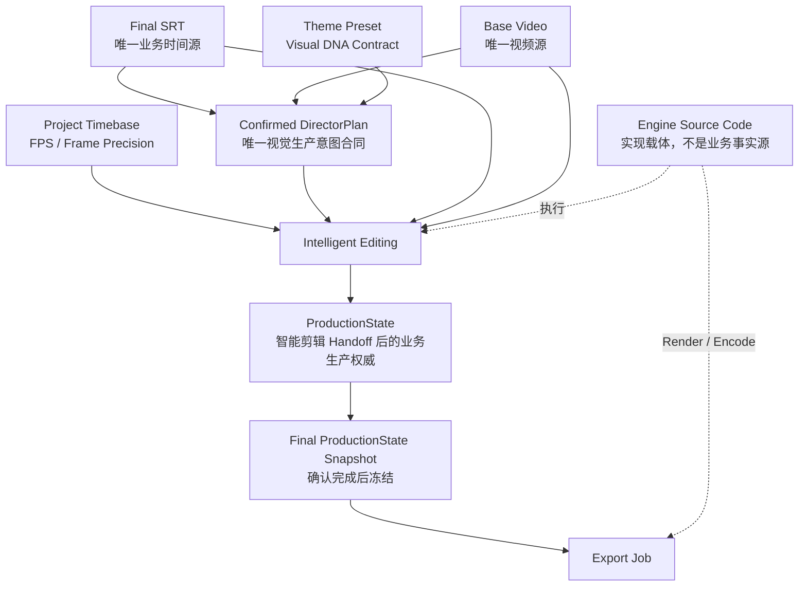
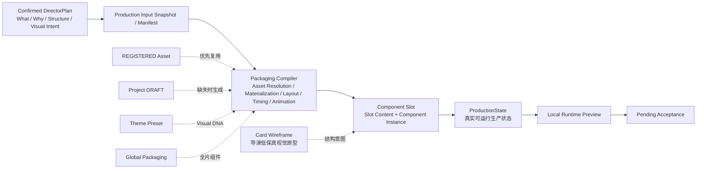
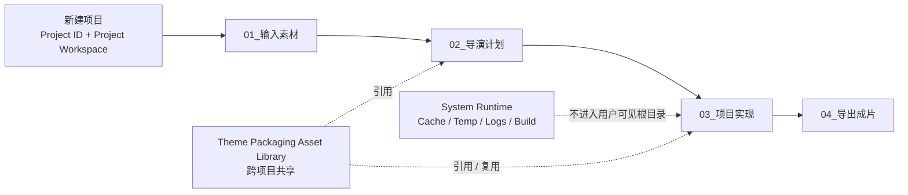

# AI DIRECTOR 产品架构 R3

> **产品：** AI DIRECTOR｜AI 视频导演工作台 / 视频生产线  
> **版本：** R3  
> **文档状态：** Frozen Baseline｜正式冻结基线  
> **基线版本：** 1.0  
> **最后确认：** 2026-09-19  
> **定位：** R3 最高层产品架构、生命周期、模块边界、事实源与跨模块握手合同。

---

# 0｜文档身份与事实源

本文是 AI DIRECTOR R3 的最高层产品事实源。研发、产品、设计、Skill、Agent、Workbench、Engine Adapter、Asset Library 与 Export 实现均必须首先服从本文。

R3 是一套 **Complete Specification｜完整规格**：研发不得要求额外读取 R2、历史 Delta、旧聊天记录或旧版 PRD 才能理解当前系统。历史文档只用于追溯，不参与当前默认裁决。

冲突优先级：

```text
本轮明确指令 / Frozen Delta
        ↓
00_AI DIRECTOR产品架构R3.md
        ↓
对应模块 R3 Frozen Baseline
        ↓
当前正式 Schema / Technical Contract
        ↓
历史文档
```

---

# 1｜R3 核心目标

R3 不是增加功能，而是重新划分不同阶段的不确定性与职责：

```text
事实输入
→ 语义结构
→ 视觉生产计划
→ 可执行生产状态
→ 人工验收
→ 明确导出
```

核心原则：

1. **Design Uncertainty First｜先消除设计不确定性**：导演阶段先确定表达、结构、人物策略、真实上屏内容与视觉意图。
2. **Implementation Uncertainty Later｜实现不确定性后移**：真实资产解析、代码生成、精确布局、精确 Timing、动画和 Runtime 后移到智能剪辑。
3. **Strong Direction, Free Implementation｜导演强约束，实现高自由**：上游确认结构与意图，下游拥有实现自由，但不得推翻已确认导演结构。
4. **Production Can Start From Zero Assets｜资产库不是生产前置条件**：没有成熟资产时允许生成 Project DRAFT 直接服务当前项目。
5. **Engine Independence｜引擎独立**：业务合同不绑定单一渲染/生成引擎。
6. **Production ≠ Export｜生产完成不等于文件已生成**：智能剪辑完成只形成可预览、可验收的生产状态；只有 Export 阶段且用户明确触发导出后才生成视频文件。

## 1.1｜产品级架构总览图

### 1.1.1｜端到端生命周期架构流程图



### 1.1.2｜系统分层关系图



### 1.1.3｜关键阶段边界图


### 1.1.4｜核心模块关系图



### 1.1.5｜事实源 / 权威源关系图



**裁决原则：** 上游事实源决定“什么是真的”，DirectorPlan 决定“要表达什么、如何组织”，ProductionState 决定“当前真实生产结果是什么”；Engine Source Code 只负责实现，不得反向成为业务事实源。

### 1.1.6｜DirectorPlan → ProductionState 握手图



握手边界固定为：

```text
Confirmed DirectorPlan
= What / Why / Structure / Visual Intent

Packaging Compiler
= Which Asset / How to Build / Exact Runtime

ProductionState
= 当前真实生产状态
```

### 1.1.7｜Project Workspace 项目作用域图



---

# 2｜统一命名规则

## 2.1 生命周期正式名称

原 `Intelligent Packaging｜智能包装` 自 R3 正式收口起统一为：

> **Intelligent Editing｜智能剪辑**

R3 用户可见主生命周期固定为：

```text
01 Material Preparation｜素材准备
        ↓
02 Content Understanding｜内容理解
        ↓
03 Director Arrangement｜导演编排
        ↓
04 Intelligent Editing｜智能剪辑
        ↓
05 Export｜导出
```

## 2.2 内部技术名保留规则

为避免无业务收益的工程重命名，已经稳定的技术对象名可以继续保留 `Packaging`：

- Packaging Compiler｜包装编译器
- Project Packaging Job｜整片生产父任务
- Production Input Manifest｜生产输入清单
- Packaging Engine / Engine Adapter｜生产引擎 / 引擎适配器

这些是**内部技术合同名**，不是生命周期产品名称。UI、产品文档阶段名、用户状态和导航统一使用“智能剪辑”。

---

# 3｜五阶段生命周期

## 3.1 Stage 1｜素材准备

解决：**创建项目工作空间，并建立稳定生产事实。**

用户新建项目时，系统必须同步创建：

- Project ID｜项目唯一标识；
- Project Workspace｜项目工作空间。

后续内容理解、导演编排、智能剪辑、验收与导出均在同一个 Project Workspace 作用域内持续演进。

权威输入：

- Base Video｜基础视频
- Final SRT｜最终字幕
- Project Timebase｜项目时间基准
- 可选生产素材 / 参考资料

Project Workspace 用户可见一级目录固定为：

```text
Project Workspace
├─ 01_输入素材
├─ 02_导演计划
├─ 03_项目实现
├─ 04_导出成片
└─ project.json
```

目录治理原则：

- `01_输入素材`：用户上传或明确纳入当前项目的源素材；
- `02_导演计划`：内容结构与 Confirmed DirectorPlan 等关键项目产物；
- `03_项目实现`：当前项目可复现的正式实现代码、Composition、Manifest、配置与必要引用；
- `04_导出成片`：Stage 5 明确导出的最终文件；
- `project.json`：最小项目身份与必要元数据。

Cache、Temp、Logs、Preview Cache、Build Cache、Job Runtime 等运行时内容不得污染用户可见项目根目录，应进入应用内部 System Runtime 或隐藏系统目录。

Theme Packaging Asset Library 是跨项目共享系统，只由当前项目引用，不复制为 Project Workspace 的一级目录。

本文冻结的是**产品级逻辑目录与治理原则**；具体磁盘物理路径、隐藏目录和子目录实现由后续 Storage Architecture｜存储架构合同决定。

不负责：内容分析、导演设计、真实组件生产、导出。

## 3.2 Stage 2｜内容理解

解决：**把连续口播整理成稳定的语义结构。**

核心产物：

```text
Theme Chapter｜主题章节
        ↓
Director Shot Outline｜导演分镜提纲
```

每个 Shot 至少包含：

- Shot ID
- Chapter ID
- Time Range
- Source Subtitle
- Content Summary｜内容概括
- 可选 Narrative Role｜叙事作用

Content Understanding 不正式确认 Key Message、Director Intent、人物布局、卡片线稿、组件或资产。

## 3.3 Stage 3｜导演编排

解决：**把语义结构编译成可确认的低保真视觉生产计划。**

固定三阶段：

```text
① 编排意图
→ ② 卡片线稿
→ ③ 主题预设
```

最终产物：

> **Confirmed DirectorPlan｜确认导演计划 = 正式视觉生产计划**

它明确：

- 每个 Shot 的 Key Message / Director Intent
- Visual Dominance / Character Strategy
- Screen Layout
- Card Wireframe 数量、主辅、关系与 Presentation Intent
- Display Content｜真实上屏内容
- Motion Preset / Visual Demo Intent
- Reference / Material Usage Intent
- Theme Preset 引用
- Global Packaging 启用选择

但不负责真实 Component Asset Resolution、Engine Implementation、精确 Timing、精确 Position/Size 或 Runtime。

## 3.4 Stage 4｜智能剪辑

解决：**把 Confirmed DirectorPlan 编译成真实、可运行、可编辑、可预览的 ProductionState。**

主链路：

```text
Confirmed DirectorPlan
        ↓
Production Input Snapshot / Manifest
        ↓
Project Packaging Job
        ↓
Sequential Theme Chapter Tasks
        ↓
Shared Engine Workspace
        ↓
Asset Resolution / Reuse / Generate
        ↓
Content Materialization
        ↓
Layout / Timing / Animation Compile
        ↓
Chapter QA + Read-only Live Preview
        ↓
Full ProductionState Assembly
        ↓
Engine Composition Assembly
        ↓
Global Continuity QA
        ↓
Full Candidate ProductionState
        ↓
Workbench Handoff
        ↓
Production Completed / Pending Acceptance
```

**全部章节和全部智能剪辑任务完成后，不自动渲染、不自动编码、不自动导出任何 MP4/MOV。**

用户在整片工作台中只做当前 V1 允许的轻量验收调整；点击“确认完成”仅冻结当前最终 ProductionState 作为 Export Input，不触发文件生成。

## 3.5 Stage 5｜导出

解决：**把已经确认完成的最终 ProductionState 转换成正式文件交付。**

只有用户明确执行“开始导出”后才创建 Export Job 并生成视频文件。

当前两种导出模式：

```text
Full Video Export
→ 1 × 完整 MOV

Layer Export
→ Motion Layer.mov
+ Character Layout Overlay.mov
```

---

# 4｜唯一事实源

## 4.1 Final SRT

> **唯一业务时间源｜Single Business Timing Source**

决定 Shot、组件 Start / End / Duration 的业务时间。任何 AI、DirectorPlan、Engine 不得自行改写。

## 4.2 Project Timebase

负责 FPS、帧换算、Runtime 执行、Render Precision；不是第二套业务时间源。

## 4.3 Base Video

> **唯一视频源｜Single Video Source**

## 4.4 Confirmed DirectorPlan

> **唯一视觉生产意图 / 编排合同**

## 4.5 Theme Preset

> **视频包装的 Visual DNA Contract｜视觉基因合同**

Theme Preset 不是组件集合，也不是完整页面模板。它定义项目包装层的共同视觉基因；所有支持主题继承的组件必须消费该合同。

当前 Visual DNA 合同只含五章：

1. Color｜颜色
2. Typography｜字体字号
3. Card Style｜卡片风格
4. Character Layout｜人物布局
5. Background Music｜背景音乐

`Motion Language` 不属于 Theme Preset。字幕、章节进度属于 Global Packaging，不属于 Theme Preset 五章。

## 4.6 ProductionState

智能剪辑 Handoff 后：

> **ProductionState = 当前视频生产业务权威。**

Engine Source Code 不是业务事实源。

---

# 5｜主题包装资产库是横向系统

主生命周期之外横向存在：

> **Theme Packaging Asset Library｜主题包装资产库**

它不是第六个阶段。

固定四个一级模块：

```text
Theme Preset｜主题预设
Global Packaging｜全局包装
Component Card Library｜组件卡片库
Component Draft Box｜组件草稿箱
```

其职责：

- Theme Preset：Visual DNA Contract
- Global Packaging：全片级 REGISTERED Components，目前仅 Subtitle + Chapter Progress
- Component Card Library：成熟 REGISTERED 组件资产
- Component Draft Box：Asset Library DRAFT 长期候选资产

生产可以从 0 个 Registered Asset 开始。

---

# 6｜DirectorPlan → ProductionState 核心握手

```text
Confirmed DirectorPlan
= What / Why / Structure / Visual Intent

Packaging Compiler
= Which Asset / How to Build / Exact Runtime

ProductionState
= 当前真实生产状态
```

Card Wireframe、Component Slot、Component Instance 必须分层：

```text
Card Wireframe
→ Director Arrangement 低保真产品原型

Component Slot
→ 智能剪辑生产骨架
→ Slot Content + Component Instance

Component Instance
→ 当前项目真实实例
```

删除 Component Instance 只清空实例，不删除 Slot Content。

---

# 7｜Engine Strategy

长期架构：

```text
ProductionState
→ Engine Adapter
→ Selected Engine
→ Preview / Runtime / Render
```

R3 V1：

- **HyperFrames = Primary Engine｜第一版主引擎**
- **Remotion = Expansion Engine｜扩展引擎**

DirectorPlan 不描述 React、Remotion API、HyperFrames API 或底层 Runtime 参数。

---

# 8｜智能剪辑与导出的硬边界

必须保持：

```text
智能剪辑
负责：生产 / 装配 / QA / 本地真实预览 / 轻量验收编辑
不负责：最终视频文件生成

导出
负责：Render Job / Encode / Mux / Verify / 最终文件交付
```

以下情况均**不得**自动生成视频文件：

- 单个 Theme Chapter 完成
- 所有 Theme Chapter 完成
- Global Continuity QA 完成
- Full Candidate ProductionState 形成
- Packaging Job = COMPLETED
- 用户点击“马上预览成片”
- 用户在 Workbench 中完成参数化精调
- 用户点击“确认完成”

“确认完成”只做：

```text
当前 ProductionState
→ Freeze as Final ProductionState Snapshot
→ 进入 Export READY_TO_EXPORT
```

只有：

```text
Export
→ 用户明确点击“开始导出”
→ Export Job
```

才生成文件。

---

# 9｜V1 智能剪辑验收工作台边界

允许：

- 整片真实预览 / Seek
- Chapter / Shot 定位
- 已有组件选择
- Editable Contract 内参数化精调
- Timing / Duration / Layer Order
- Position / Size / Content / Media / Layout / Theme / Animation（组件真实支持项）
- Character Layout
- Global Editing
- Delete Component
- Auto Save
- 确认完成

不开放：

- Replace Component
- New / Generate Component
- Quick Create
- 新增 Slot
- AI 重新生成
- Structural Edit
- NLE 剪辑

底层可以保留 Structural Edit 架构，但 V1 ToC 不暴露入口。

---

# 10｜资产飞轮

```text
Reuse Registered
→ Generate Project DRAFT if Missing
→ Produce
→ Validate in Real Project
→ Asset Candidate
→ Add to Draft / Register as Asset
→ Normalize + QA
→ REGISTERED
→ Future Reuse
```

严格区分：

- REGISTERED
- Asset Library DRAFT
- Project DRAFT
- Asset Candidate
- Job-local Shared Component

这些不是同一种状态。

---

# 11｜R3 正式文档体系

研发默认只需要读取以下六份正式基线：

```text
00_AI DIRECTOR产品架构R3.md
01_AI DIRECTOR内容理解与导演编排R3.md
02_AI DIRECTOR智能剪辑R3.md
03_AI DIRECTOR智能剪辑工作台R3.md
04_AI DIRECTOR主题包装资产库R3.md
05_AI DIRECTOR导出R3.md
```

任何 R2 / Delta / Handoff 只作为历史追溯，不是当前研发前置依赖。

---

# 12｜不可隐式修改的 R3 Invariants

1. 五阶段生命周期固定。
2. Stage 4 正式名称固定为“智能剪辑”。
3. Final SRT 是唯一业务时间源。
4. Base Video 是唯一视频源。
5. Confirmed DirectorPlan 是唯一视觉生产意图合同。
6. Theme Preset 是 Visual DNA Contract，且当前只有五章。
7. Motion Language 不属于 Theme Preset。
8. Global Packaging 当前仅 Subtitle + Chapter Progress。
9. ProductionState 是 Handoff 后业务生产权威。
10. Engine 架构保持独立；V1 HyperFrames Primary、Remotion Expansion。
11. Registered Asset 不是生产前置条件。
12. Project DRAFT 不自动进入 Draft Box。
13. V1 章节按 Theme Chapter 时序执行，不按 Shot 拆独立任务。
14. 章节完成仅 Live Code Preview，不做中间 Render/Export。
15. 全部智能剪辑任务完成也不自动输出视频文件。
16. Topic 2–4 属于 Production Completed / Pending Acceptance。
17. V1 无 Confirm Production、无后置 Production QA。
18. “确认完成”是 Stage 4 唯一最终业务动作，仅冻结最终 ProductionState。
19. Export 是独立第 5 生命周期阶段。
20. 只有用户在 Export 中明确启动导出才生成视频文件。
21. 新建项目时必须创建唯一 Project ID 与 Project Workspace。
22. 后续项目级事实、计划、实现状态与导出产物必须可追溯到同一 Project ID。
23. 用户可见 Project Workspace 一级目录固定为 `01_输入素材 / 02_导演计划 / 03_项目实现 / 04_导出成片`，另保留最小 `project.json`。
24. Cache / Temp / Logs / Preview / Build / Job Runtime 等不得污染用户可见项目根目录；Theme Packaging Asset Library 保持跨项目共享。

---

# 13｜Baseline Effect

本文生效后，所有与本文冲突的旧 R2/R3 宏观假设视为 Superseded。模块级研发必须以六份 R3 Frozen Baseline 为唯一默认事实源；不允许通过历史文档恢复已经被 R3 覆盖的旧语义。
