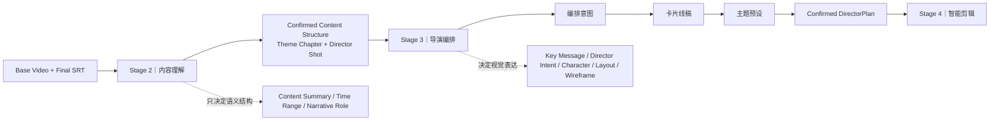
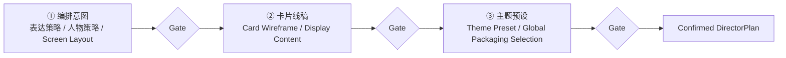
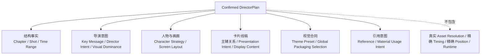

# AI DIRECTOR 内容理解与导演编排 R3

> **产品：** AI DIRECTOR｜AI 视频导演工作台 / 视频生产线  
> **版本：** R3  
> **文档状态：** Frozen Baseline｜正式冻结基线  
> **基线版本：** 1.0  
> **最后确认：** 2026-09-19  
> **范围：** Content Understanding｜内容理解 + Director Arrangement｜导演编排 + Confirmed DirectorPlan｜确认导演计划交接。

---

# 0｜文档身份

本文是 R3 Stage 2「内容理解」与 Stage 3「导演编排」的完整研发基线。

本文已经吸收当前仍有效的 R2 能力与 R3 已确认增量，研发无需再读取 R2、历史 Patch、旧 PRD 或聊天记录补全本模块。

上位架构：`00_AI DIRECTOR产品架构R3.md`。

下游正式交付对象：

> **Confirmed DirectorPlan｜确认导演计划**

下游生命周期正式名称统一为：

> **Intelligent Editing｜智能剪辑**

旧 `Intelligent Packaging｜智能包装` 仅允许出现在历史说明或稳定内部技术对象名中，不再作为产品阶段名称。

---

# 1｜模块总链路

```text
Base Video + Final SRT
        ↓
Content Understanding｜内容理解
        ↓
Confirmed Content Structure｜已确认内容结构
        ↓
Director Arrangement｜导演编排
        ↓
① 编排意图
→ ② 卡片线稿
→ ③ 主题预设
        ↓
Confirmed DirectorPlan｜确认导演计划
        ↓
Intelligent Editing｜智能剪辑
```

两个阶段解决不同问题：

```text
内容理解
= 怎么切

导演编排
= 怎么演 / 怎么视觉表达
```

不得把两个阶段重新合并成一套重复分析流程。


## 1.1｜Stage 2 → Stage 3 职责与交付图



## 1.2｜导演编排三阶段与 Gate



## 1.3｜Confirmed DirectorPlan 合同总览



---

# 2｜唯一输入事实

本模块始终运行在当前 **Project Workspace｜项目工作空间** 内。Base Video、Final SRT、Confirmed Content Structure 与 Confirmed DirectorPlan 必须归属于同一个 Project ID；正式导演计划写入当前项目的 `02_导演计划` 作用域。具体物理路径不在本模块定义。

## 2.1 Base Video｜基础视频

> 唯一视频源。

提供：

- 视频时长；
- 媒体元信息；
- 必要视觉边界辅助；
- 后续真实预览的基础视频引用。

## 2.2 Final SRT｜最终字幕

> **唯一业务时间源。**

内容理解和导演编排不得建立第二套时间事实。

任何 Shot Time Range 均必须可追溯到 Final SRT / Project Timebase。

## 2.3 Project Timebase｜项目时间基准

负责 FPS 与帧换算，不替代 Final SRT 的业务时间事实。

---

# PART A｜内容理解

# 3｜Content Understanding 定位

内容理解的唯一核心任务：

> **把连续视频内容整理为可快速审核的 Theme Chapter｜主题章节 → Director Shot｜导演分镜结构。**

它负责“语义结构”，不负责“视觉设计”。

---

# 4｜内容理解输出合同

正式输出：

```text
Confirmed Content Structure
│
├─ Theme Chapter
│  ├─ Chapter ID
│  ├─ Chapter Title
│  ├─ Time Range
│  ├─ Chapter Description
│  └─ Director Shots
│
└─ Director Shot
   ├─ Shot ID
   ├─ Chapter ID
   ├─ Shot Title / Content Summary
   ├─ Time Range
   ├─ Source Subtitle
   └─ Narrative Role｜可选
```

### Content Summary｜内容概括

只回答：

> **这一段在讲什么。**

它不是：

- Key Message｜核心信息；
- Director Intent｜导演意图；
- Visual Focus｜视觉聚焦；
- Card Wireframe｜卡片线稿内容。

### Key Message 的正式归属

`Key Message｜核心信息` 在 **Director Arrangement｜导演编排** 中生成 / 确认。

这样避免当前旧文档中“内容理解已经确认 Key Message”与“内容理解不得确认 Key Message”的冲突。

---

# 5｜切分规则

## 5.1 Theme Chapter｜主题章节

按：

> **宏观叙事任务变化**

切分。

原则：

- 知识点变化优先落到 Shot；
- 只有宏观叙事任务真正变化才升级 Chapter；
- 不设固定 Chapter 数；
- 不按固定秒数切 Chapter；
- 短视频大量 Chapter 触发过度切分检查。

## 5.2 Director Shot｜导演分镜

Shot 是 Chapter 内的独立表达任务。

原则：

- 不按字幕断句机械切；
- 不按固定秒数机械切；
- 一个完整表达任务可形成一个 Shot；
- 过粗则拆分；
- 过碎则合并；
- 保持原视频顺序和时间连续性。

---

# 6｜内容理解明确不负责

不正式确认：

- Key Message；
- Director Intent；
- Visual Dominance / Visual Focus；
- Character Strategy / Character Layout；
- Screen Layout；
- Card Wireframe；
- Component / Asset；
- Component ID / Version；
- Position / Size / Layer；
- Animation；
- Runtime。

---

# 7｜内容理解工作台

V1 采用：

> **Workbench = 读取 / 展示 / 刷新 / 确认；Codex = 深度讨论 / 修改 / 文件回写。**

UI：

```text
┌──────────────┬─────────────────────────────────┬──────────────────┐
│ Lifecycle    │ Content Understanding           │ Context Drawer   │
│              │                                 │                  │
│ 素材准备      │ Rich Text / Markdown Review     │ Base Video ✓     │
│ 内容理解 ●    │ Chapter 01                      │ Final SRT ✓      │
│ 导演编排      │ ├ Shot 01                       │ Chapters / Shots │
│ 智能剪辑      │ ├ Shot 02                       │ Draft / Confirmed│
│ 导出          │ └ Shot 03                       │                  │
│              │                                 │ 从 Codex 更新     │
│              │ 去 Codex 修改                    │ 确认结构          │
└──────────────┴─────────────────────────────────┴──────────────────┘
```

冻结规则：

- 内容理解阶段**不新增 Chapter / Shot 左侧树**；
- 不建设完整拖拽结构编辑器；
- 不内嵌自由 AI Chat；
- 不出现人物、卡片、组件配置；
- 用户需要复杂结构修改时通过 Codex 完成。

---

# 8｜Codex 修改闭环

允许：

- Chapter 合并 / 拆分；
- Chapter 标题 / 描述；
- Shot 合并 / 拆分；
- Shot 边界 / 归属；
- Content Summary。

不允许顺带进入导演设计。

“从 Codex 更新”只执行：

```text
Read Latest File
→ Validate
→ Refresh Workbench
```

不自动触发新的 AI 生成。

完成 Gate：

> `Confirmed Content Structure｜已确认内容结构`

一旦确认，下游不得静默改变 Chapter / Shot 结构。

发现结构问题必须显式返回 Content Understanding 修正。

## 8.1 Content Understanding Skill｜内容理解 Skill

稳定能力合同：

```text
Final SRT + Base Video Timebase
        ↓
Semantic Segmentation｜语义分段
        ↓
Narrative Task Detection｜叙事任务识别
        ↓
Theme Chapter Segmentation｜主题章节划分
        ↓
Director Shot Segmentation｜导演分镜划分
        ↓
Structure QA｜结构检查
        ↓
Content Understanding Artifact｜内容理解产物
```

至少执行以下确定性 / 规则型检查：

- Chapter 是否过细；
- Shot 是否过碎或过粗；
- 是否机械按字幕断句；
- 是否机械按固定秒数；
- Content Summary 是否忠于原始内容；
- Source Traceability｜源内容追溯是否完整；
- 是否增加原视频 / Final SRT 中不存在的事实。

异常与兜底：

- Base Video 与 Final SRT 时间明显不一致 → `BLOCK｜阻塞`，不得猜时间；
- 无法稳定判断边界 → 优先保留更大的完整语义单元；
- 不得因为下游包装需求反向篡改内容结构。

---

# PART B｜导演编排

# 9｜Director Arrangement 定位

导演编排是：

> **智能剪辑之前的低保真产品原型设计 + 正式视觉生产计划阶段。**

目标：尽量用低成本的文字、结构化数据、Card Wireframe 和 Graybox Previs 消除高层视觉设计不确定性。

导演编排不承担真实组件工程实现。

---

# 10｜Director Workbench 固定三阶段

```text
① 编排意图
        ↓
② 卡片线稿
        ↓
③ 主题预设
```

节点名称冻结，不延伸为更多主阶段。

前两阶段 Shot-level；第三阶段 Project-level。

工作台始终保持同一操作心智：

```text
上：Graybox / Theme Preview
下：Card Wireframe Track
右：当前对象 Inspector
```

---

# 11｜Director Workbench 总体 UI

```text
┌─────────────────────────────────────────────────────────────────────┐
│ Header｜Project / Version / Save State                              │
├──────────────┬──────────────────────────────────┬───────────────────┤
│ Left Nav     │ ① 编排意图 → ② 卡片线稿 → ③ 主题预设 │ Right Inspector   │
│              ├──────────────────────────────────┤                   │
│ Chapter      │ Graybox Previs                   │ 随阶段 / 对象切换   │
│ └ Shot       │                                  │                   │
│ └ Shot       ├──────────────────────────────────┤                   │
│              │ Card Wireframe Track             │                   │
└──────────────┴──────────────────────────────────┴───────────────────┘
```

视觉壳层：

- Black Header；
- Black Left Navigation；
- White Center Workspace；
- White Right Inspector；
- Orange Accent；
- 默认项目画幅 `1080 × 1920 / 9:16`，实际显示服从 Project Canvas。

左侧两级封顶：

```text
Theme Chapter
└─ Director Shot
```

不得新增 Component / Asset 第三层导航。

---

# 12｜Stage 1：编排意图

## 12.1 目标

回答：

> **这一镜为什么这样表达、画面如何组织、人物怎么安排、需要几张卡片、卡片是什么关系。**

AI / Director Skill 深度参与。

每个 Shot 至少确认：

- Key Message｜核心信息；
- Director Intent｜导演意图；
- Visual Dominance｜视觉主导；
- Character Strategy｜人物策略；
- Screen Layout｜画面布局；
- Card Wireframe Structure｜卡片线稿结构；
- Visual Demo Suggestion / Intent｜可视化演示建议 / 意图（如有）。

## 12.2 Visual Dominance

可表达：

- Character-led；
- Balanced；
- Visual-led；
- Full Visual。

## 12.3 Character Strategy

表达结构语义，不锁像素：

- 人物主体；
- 左侧人物；
- 右侧人物；
- 小框人物；
- 角落头像；
- 暂时隐藏。

## 12.4 Screen Layout

高层构图示例：

- Full Screen；
- Left / Right Split；
- Top / Bottom Split；
- Main Visual + PIP；
- Center Visual。

不得把高层布局留给智能剪辑重新猜。

---

# 13｜Card Wireframe 合同

Card Wireframe 是：

> **未来真实组件的低保真产品原型。**

不是 Registered Component，不绑定真实 Component ID。

至少确认：

- Card Core Point｜核心观点；
- Primary / Supporting｜主 / 辅；
- Visual Focus｜视觉聚焦；
- Information Hierarchy｜信息层级；
- Information Density｜信息密度；
- Relation Intent｜关系意图；
- Presentation Intent｜Overlay / In-Zone（需要时）；
- 卡片顺序与大体空间关系。

允许：

> `Card Wireframe Count = 0`

人物表达已经足够、额外包装无明显价值时，零卡片是有效导演结果。

## 13.1 Stage 1 Card Wireframe Track｜阶段一线稿轨操作

在“编排意图”阶段，Card Wireframe Track 允许在**结构层**执行：

- 选择 Card Wireframe；
- 新增 Card Wireframe；
- 删除 Card Wireframe；
- 调整 Card 顺序；
- 修改 Primary / Supporting｜主 / 辅关系；
- 通过 Edit Request Patch 请求改变卡片结构。

如果调整会导致内容重新组织、关系改变或整体结构变化：

> **必须通过 Director Skill / Codex 形成新版 Draft，不由前端静默拼接或重排内容。**

---

# 14｜章节视觉节奏与连续性

Director Skill 生成当前 Shot 时至少读取：

```text
Previous Shot
+ Current Shot
+ Next Shot
```

原则：

- 不逐 Shot 孤立优化；
- 避免每个 Shot 都同样重包装；
- 人物主侧优先连续；
- 视觉密度与节奏连续；
- 同一解释任务优先延续 Card Wireframe；
- 能更新内容就不重做结构；
- 只有明确导演意图才做 `Excursion｜局部出走`。

默认连续性模型：

> **Anchor + Excursion｜视觉锚点 + 局部出走。**

---

# 15｜Graybox Previs｜灰模预演

定位：

> **结构真实，视觉轻量。**

事实源仍是结构化 Shot + Card Wireframe 数据，Graybox 只是可视化结果。

必须准确展示：

- 当前 Shot 画面结构；
- 人物大致布局；
- 卡片数量 / 主次；
- 卡片空间关系；
- 信息关系；
- 流程 / 架构 / 关系 / 媒体占位；
- Visual Demo Intent 必要占位。

Stage 1：使用真实语义内容骨架，不使用 Lorem Ipsum。  
Stage 2：使用已冻结的最终 Display Content。

Graybox 不要求：

- 真实 Base Video；
- 最终字体 / 颜色 / 玻璃质感；
- 真实 Component；
- 最终动画；
- 精确 Timing / Position / Size；
- React / HyperFrames / Remotion 代码。

V1 Primitive 至少支持：

- Text Block；
- Card Block；
- Character Placeholder；
- Image / Media Placeholder；
- Arrow / Flow / Hierarchy / Comparison / Relationship Diagram；
- Visual Demo Placeholder；
- Reference / Material Badge。

---

# 16｜Stage 1 Codex Patch Loop

结构性重设计走：

```text
Edit Request Patch
→ Go to Codex
→ New DirectorPlan Draft
→ From Codex Update
→ Schema Validation
→ Refresh Shot / Card Wireframe / Graybox
→ 用户确认
```

Patch 至少包含：

- Target Shot；
- Modify；
- Keep；
- Scope；
- 当前 Draft 路径；
- Patch 路径；
- 新版本输出路径。

Codex 只能：

```text
Draft + Patch → New Draft
```

不能自动把 Draft 提升为 Confirmed。

---

# 17｜Stage 2：卡片线稿

Stage 2 不重新设计 Shot，而是把已确认结构推进为可直接生产的线稿定稿。

默认：

> **Local Deterministic Editing｜本地确定性编辑，不调用大模型。**

点击当前 Card Wireframe，右侧只显示当前 Card：

1. Card Core Point；
2. Card Structure；
3. Display Content｜Markdown；
4. Motion Preset；
5. References & Materials。

Markdown 承担内容层级：

```text
# 主标题
## 一级内容
### 二级内容
正文 / 说明
```

Motion Preset 表达导演级演进意图，例如：

- Sequential Reveal；
- Keep Previous；
- Fade Previous；
- Focus Current；
- Build Up；
- Final Emphasis；
- Simultaneous。

不包含精确秒数、帧、Easing、Spring 等 Runtime 参数。

保存：

```text
Workbench
→ 直接写入本地 DirectorPlan Draft
→ Graybox 即时刷新
```

如果修改从“三点流程”变成“左右对比”等结构变化，必须退回 Stage 1 重确认，不得在 Stage 2 静默改变结构。

---

# 18｜References & Materials｜参考资料与生产素材

## 18.1 Reference｜参考资料

用于理解：

- Style；
- Layout；
- Content；
- Demo。

不一定进入最终视频。

## 18.2 Material｜生产素材

用于真实生产：

- Screen Recording；
- Screenshot；
- Product Image；
- Logo；
- Document Figure；
- 其他 Media。

最小条目：

- Stable Reference / Material ID；
- Type；
- Role；
- Usage Intent；
- Note。

Usage Intent：

- Reference Only；
- Preferred Material；
- Must Use；
- Placeholder Only。

视频 / 录屏类可声明：

- Embedded Playback；
- Screenshot Extraction；
- Keyframe Summary；
- PIP Demo；
- Media Placeholder。

精确剪辑点仍由智能剪辑 Timing Compile 处理。

---

# 19｜Stage 3：主题预设

Stage 3 为 Project-level。

进入条件：

- 所有 Shot 结构确认；
- 所有 Card Wireframe 内容确认。

## 19.1 Theme Preset 正式定位

> **Theme Preset = 当前项目的视频包装 Visual DNA Contract｜视觉基因合同。**

它是视觉默认合同，不是组件集合，也不是不可覆盖的硬锁。

当前 Theme Preset 只引用五章：

1. Color｜颜色；
2. Typography｜字体字号；
3. Card Style｜卡片风格；
4. Character Layout｜人物布局；
5. Background Music｜背景音乐。

完整合同由 `04_AI DIRECTOR主题包装资产库R3.md` 内部定义，研发不需要读取额外 Theme Preset 文件。

**Motion Language 不属于 Theme Preset。**

## 19.2 Global Packaging 与 Theme Preset 分离

当前 Global Packaging 仅：

- Subtitle｜字幕；
- Chapter Progress｜章节进度。

Stage 3 只选择当前项目是否启用这些 Global Components，不把它们混入 Visual DNA 五章。

Logo / 角标 / 贴片 / 普通图片视频属于普通 Media Component，不属于 Global Packaging。

## 19.3 Theme Preset 继承

```text
Theme Preset Default
+
Component Instance Override
```

局部 Override：

- 只影响当前实例；
- 不反向改 Theme Preset；
- 不默认影响其他实例。

原则：

> **改啥动啥。**

---

# 20｜Stage 3 UI

```text
┌───────────────────────────────────────────────────────────────────┐
│ ① 编排意图 ✓      ② 卡片线稿 ✓      ③ 主题预设 ●              │
├──────────────┬────────────────────────────────┬───────────────────┤
│ Left Nav     │ Theme Preview                  │ Project Theme     │
│              │                                │                   │
│ Chapter/Shot │ 主题卡片 / 人物布局 /           │ Theme Preset      │
│ 仅用于查看    │ Global Packaging 示例           │ Global ON/OFF     │
│              │                                │ Version / Status  │
└──────────────┴────────────────────────────────┴───────────────────┘
```

Stage 3 不调用大模型。

保存 / 确认：

```text
Save Theme
→ Deterministic Validation
→ Merge Confirmed Shots + Cards + Theme
→ Generate Confirmed DirectorPlan
→ DIRECTORPLAN_CONFIRMED
→ Handoff to Intelligent Editing
```

DirectorPlan 生成是结构化确定性合并，应快速完成，不使用长时间 Loading。

主操作：

> **确认并进入智能剪辑**

---

# 21｜Director Arrangement Skill

负责：

- 读取已确认 Content Structure；
- 读取当前 / 相邻 Shot；
- 生成 Key Message / Director Decision；
- 生成 Card Wireframe Structure；
- 生成 Graybox 所需结构化数据；
- 识别 Visual Demo Opportunity；
- 根据 Edit Request Patch 重设计结构。

不负责：

- 真实 Component ID；
- Asset Resolution；
- Engine Implementation；
- Runtime；
- Export。

Skill 可升级，但必须保持 DirectorPlan Schema 兼容；Skill 升级不得隐式修改已确认基线或已确认 DirectorPlan。

---

# 22｜状态模型

内容理解：

- STRUCTURE_DRAFT；
- STRUCTURE_CONFIRMED。

导演编排 Stage 1：

- STRUCTURE_DRAFT；
- UPDATED_FROM_CODEX；
- STRUCTURE_CONFIRMED。

Stage 2：

- CONTENT_DRAFT；
- SHOT_CONFIRMED。

Stage 3：

- READY_FOR_THEME；
- THEME_CONFIRMED。

最终：

- DIRECTORPLAN_CONFIRMED。

---

# 23｜确定性 QA 与 Gate

## 23.1 内容理解 Gate

检查：

- Chapter 是否过细；
- Shot 是否过碎 / 过粗；
- 是否机械按字幕断句 / 固定秒数；
- Content Summary 是否忠于原文；
- Time Range 是否可追溯；
- 是否新增源内容没有的事实。

## 23.2 编排意图 Gate

每个 Shot：

- Key Message；
- Director Intent；
- Character Strategy；
- Screen Layout；
- Card 数量 / 主辅 / 关系；
- Graybox；
- Visual Demo Intent（如有）。

## 23.3 卡片线稿 Gate

每张 Card：

- Card Core Point 非空；
- Display Content 非空；
- Markdown 层级有效；
- Motion Preset 已确认；
- Reference / Material 依赖可解析；
- Must Use 素材存在有效引用，或显式 Placeholder。

## 23.4 主题预设 Gate

- Theme Preset 已选择；
- 五章 Visual DNA 合同可解析；
- Global Packaging ON/OFF 已确认；
- DirectorPlan Schema 有效；
- 引用完整。

最终增加轻量 Preflight：

- Time；
- Space；
- Reading Load。

这里只识别明显风险，不进入精确 Runtime QA。

---

# 24｜Confirmed DirectorPlan 正式合同

最终 Confirmed DirectorPlan 至少表达：

```text
Project / Version
Theme Chapters
Director Shots
  ├─ Time Range / Source Subtitle
  ├─ Key Message
  ├─ Director Intent
  ├─ Visual Dominance
  ├─ Character Strategy
  ├─ Screen Layout
  ├─ Card Wireframes
  │   ├─ Primary / Supporting
  │   ├─ Presentation Intent
  │   ├─ Card Core Point
  │   ├─ Display Content
  │   ├─ Relation / Density / Hierarchy
  │   ├─ Motion Preset
  │   └─ References & Materials
  └─ Visual Demo Intent

Theme Preset Reference
Global Packaging Selection
```

允许显式 Pinned Mature Asset Reference，但一般真实 Asset Resolution 后移到智能剪辑。

Confirmed DirectorPlan 不复制 Base Video、Final SRT、素材二进制本体。

---

# 25｜交接智能剪辑

智能剪辑接收 Confirmed DirectorPlan 后负责：

- Production Input Snapshot / Manifest；
- Asset Resolution；
- Registered Asset 复用；
- Job-local Shared Component 复用；
- 缺失组件 Project DRAFT 创建；
- Component Slot / Instance；
- Content Materialization；
- Reference Interpretation；
- Material Binding；
- Layout / Timing / Animation Compile；
- ProductionState；
- Engine Runtime Preview；
- Production QA。

不得重新推翻：

- 已确认 Key Message；
- 导演意图；
- Shot 高层布局；
- 人物策略；
- 卡片数量 / 关系；
- Display Content 核心事实；
- Visual Demo Intent；
- Must Use 素材；
- Theme Preset 选择。

---

# 26｜明确非职责

本模块不负责：

- 真实 Component ID / Version 解析；
- 真实 Engine Child 兼容性；
- 组件代码生成；
- 精确 Position / Size / Timing；
- Runtime 执行；
- 最终高保真生产；
- 视频文件渲染 / 编码 / 导出。

---

# 27｜Superseded Rules

以下旧规则失效：

1. 内容理解直接完成完整导演设计。
2. Director 阶段必须绑定真实 Component ID。
3. Director 阶段必须选择 Registered Component。
4. Director 阶段必须完成真实 Asset Match。
5. Director 阶段必须证明 Runtime Executability。
6. Director 阶段必须做真实 Engine Preview。
7. Card Pattern 固定词表作为强制创造约束。
8. 智能剪辑重新做一轮高层视觉设计。
9. Theme Preset 包含 Motion Language。
10. Theme Preset 包含 Subtitle / Chapter Progress / Logo 等 Global Components。
11. DirectorPlan 自动生成后直接成为 Confirmed。

---

# 28｜Frozen Invariants

1. Content Understanding 只确定语义结构，不做正式视觉设计。
2. Key Message 在 Director Arrangement 生成 / 确认。
3. Theme Chapter → Director Shot 两级封顶。
4. Director Shot 是导演编排最小核心单元。
5. Director Workbench 三阶段名称固定。
6. Graybox 是结构可视化，不是事实源。
7. Card Wireframe 不绑定真实 Component ID。
8. Stage 1 结构修改走 Codex Patch Loop。
9. Stage 2 默认本地确定性编辑。
10. Stage 3 为 Project-level。
11. Theme Preset = Visual DNA Contract，当前仅五章。
12. Motion Language 不属于 Theme Preset。
13. Global Packaging 与 Theme Preset 分离。
14. Global Packaging 当前仅 Subtitle + Chapter Progress。
15. Confirmed DirectorPlan = 智能剪辑正式生产计划。
16. Confirmed 状态不得被 Skill / Codex / 下游隐式覆盖。
17. Director 不承担真实 Asset Resolution。
18. Director 不承担 Runtime / Render / Export。

---

# 29｜Baseline Effect

本文生效后，所有与本文冲突的 R2 / 旧 R3 内容理解、导演编排、Theme Stage 规则视为 Superseded。研发只需结合 `00_AI DIRECTOR产品架构R3.md` 与本文即可完成 Stage 2–3 产品与交接实现，不依赖 R2。
