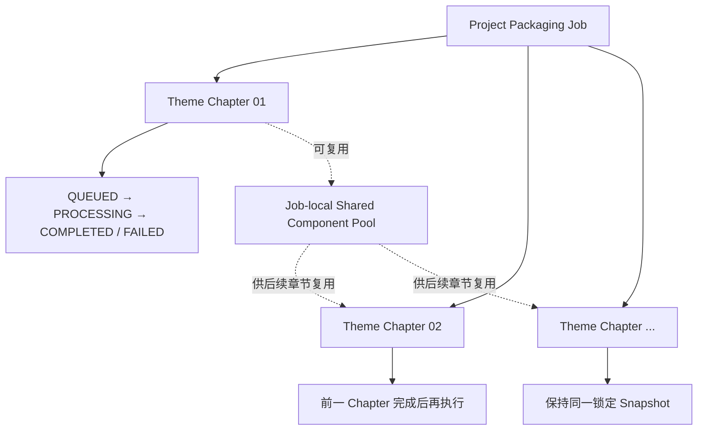
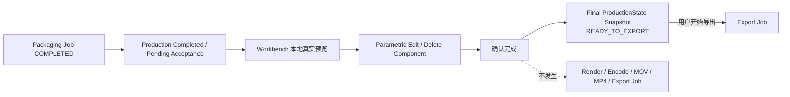

# AI DIRECTOR 智能剪辑 R3

> **产品：** AI DIRECTOR｜AI 视频导演工作台 / 视频生产线  
> **版本：** R3  
> **文档状态：** Frozen Baseline｜正式冻结基线  
> **基线版本：** 1.0  
> **最后确认：** 2026-09-19  
> **范围：** Intelligent Editing｜智能剪辑业务架构、生产任务合同、Director → Editing → Engine → ProductionState 握手、任务内复用、QA、资产候选形成与 Stage 5 交接。

---

# 0｜文档身份

本文是 R3 生命周期第 4 阶段：

> **Intelligent Editing｜智能剪辑**

的完整业务与工程职责基线。

本文已经吸收当前仍有效的 R2 智能包装 / Workbench 生产合同与全部 R3 Frozen Delta，研发不需要再读取 R2 或历史 Part / Topic / Handoff 文档补全本模块。

上游：`01_AI DIRECTOR内容理解与导演编排R3.md`  
下游交互：`03_AI DIRECTOR智能剪辑工作台R3.md`  
资产体系：`04_AI DIRECTOR主题包装资产库R3.md`  
文件交付：`05_AI DIRECTOR导出R3.md`

---

# 1｜统一命名与技术对象

产品阶段统一叫：

> **智能剪辑｜Intelligent Editing**

旧“智能包装”不再作为 UI、导航、状态页、产品文档阶段名。

以下稳定内部技术对象可以保留 `Packaging`，避免无收益工程改名：

- Packaging Compiler；
- Project Packaging Job；
- Production Input Manifest；
- Local Packaging Orchestrator；
- Packaging Engine。

它们是内部执行对象，不改变生命周期名称。

---

# 2｜智能剪辑解决什么

输入已经是确认过的正式视觉生产计划：

> **Confirmed DirectorPlan｜确认导演计划**

智能剪辑不再重新回答：

> “这一 Shot 应该怎么设计？”

它回答：

> **“已经确认的导演计划，如何低成本、可靠地变成真实、可运行、可编辑、可预览的 ProductionState？”**

因此：

```text
Director Arrangement
= What / Why / Structure / Visual Intent

Intelligent Editing
= Which Asset / How to Build / Exact Runtime
```

---

# 3｜核心设计原则

1. **Design Frozen Upstream｜高层设计在上游确认。**
2. **Implementation Freedom｜实现层保留自由。**
3. **ProductionState Is Business Truth｜生产状态是业务事实。**
4. **Engine Independence｜引擎独立。**
5. **Reuse First｜优先复用。**
6. **Generate What Is Missing｜缺什么再生成。**
7. **Theme Chapter = V1 Execution Unit｜主题章节是 V1 执行单元。**
8. **Sequential First｜V1 时序执行。**
9. **No Intermediate Render｜禁止中间视频文件渲染。**
10. **Production Completed ≠ Exported｜生产完成不等于已导出。**


## 3.1｜智能剪辑执行架构图


## 3.2｜任务层级与状态关系图



## 3.3｜Production → Acceptance → Export 边界图



---

# 4｜权威输入合同

智能剪辑启动时读取以下独立权威输入：

```text
Final SRT
= Single Business Timing Source｜唯一业务时间源

Base Video
= Single Video Source｜唯一视频源

Confirmed DirectorPlan
= Single Visual Production Intent Contract｜唯一视觉生产意图合同

Theme Preset
= Visual DNA Contract｜视觉基因合同

Materials
= Production Material Source｜生产素材源

References
= Reference Source｜参考资料源

Pinned Mature Asset References｜如有
= 显式成熟资产依赖
```

DirectorPlan 不复制 Base Video、SRT 或素材二进制本体，只保存稳定引用与使用意图。

---

# 5｜Production Input Snapshot / Manifest

每次正式启动智能剪辑必须锁定：

> **Production Input Snapshot｜生产输入快照**

至少包含：

- DirectorPlan Version；
- Final SRT Version；
- Base Video Version；
- Theme Preset Version；
- Materials / References；
- Pinned Mature Asset References；
- Selected Engine；
- 已解析 Engine Child Implementation Version（实际使用时）。

作用：

- Re-run；
- Retry；
- Recovery；
- QA；
- Traceability；
- Reproducibility。

`Production Input Manifest` 是机器入口，只负责索引、声明、版本锁定，不重写上游事实。

---

# 6｜整体业务架构

```text
Confirmed Facts
        ↓
Production Input Snapshot / Manifest
        ↓
Project Packaging Job｜整片生产父任务
        ↓
Packaging Compiler
        ↓
Local Packaging Orchestrator
        ↓
Shared Engine Workspace
        ↓
Reuse Opportunity Scan
        ↓
Sequential Theme Chapter Tasks
        ↓
Asset Resolution / Reuse / Generate
        ↓
Chapter ProductionState Subtrees
        ↓
Chapter QA
        ↓
Read-only Chapter Stage Preview
        ↓
Reusable Component Extraction｜必要时
        ↓
Job-local Shared Component Pool
        ↓
后续 Chapter 继续时序生产
        ↓
Full ProductionState Assembly
        +
Engine Composition Assembly
        ↓
Global Continuity QA
        ↓
Full Candidate ProductionState
        ↓
Formal Workbench Handoff
        ↓
Production Completed / Pending Acceptance
        ↓
用户轻量验收编辑
        ↓
确认完成
        ↓
Final ProductionState Snapshot
        ↓
05 Export｜READY_TO_EXPORT
```

**该链路中没有自动视频文件导出。**

---

# 7｜核心模块职责

| 模块 | 负责 | 不负责 |
|---|---|---|
| Packaging Compiler | 把确认输入编译成生产任务与 ProductionState | Shell / 进程管理、重新导演设计 |
| Local Packaging Orchestrator | Job、进程、文件、Agent、Engine、失败恢复、状态 | 高层视觉设计 |
| Coding Agent｜V1 Codex | 真实创建 / 修改 Engine 工程和组件代码 | 定义业务事实源 |
| Engine Adapter | 隔离引擎差异、把业务参数映射到 Engine | 内容理解 / 导演决策 |
| Engine | Preview / Runtime / Render 能力 | 业务状态权威 |
| ProductionState | 当前视频可执行业务生产事实 | 自由导演想法 |
| Asset Library | 成熟资产复用、长期资产沉淀 | 生命周期顺序阶段 |
| Project Packaging Job | 管理整片生产与章节子任务 | 单一 Chapter Task |
| Theme Chapter Task | 章节级真实生产、QA、只读预览 | 按 Shot 拆独立 Job |
| Job-local Shared Pool | 当前任务内临时复用 | 长期正式资产库 |

---

# 8｜Task Contract V2｜任务合同

## 8.1 Execution Unit｜执行单元

正式冻结：

> **Theme Chapter = V1 Intelligent Editing Execution Unit。**

Project Packaging Job 按 Theme Chapter 拆子任务。

**不按 Director Shot 拆独立智能剪辑任务。**

Shot 仍是 Chapter 内部生产结构。

## 8.2 Sequential Execution｜时序执行

V1：

```text
Chapter 01
→ 生产 / QA / 共享组件抽取 / 只读预览
        ↓
Chapter 02
→ 优先复用 Chapter 01 已验证结果
        ↓
Chapter 03
        ↓
...
```

目的：

- 后续章节更快；
- 当前视频视觉一致性更高；
- 让真实生产逐步沉淀任务内复用能力。

未来并行属于新 Delta，不在 V1 自动扩展。

---

# 9｜Shared Engine Workspace｜共享引擎工作区

所有 Theme Chapter Task：

> **共享同一个 Engine Workspace。**

不得为每个 Chapter 创建彼此孤立、无法复用组件的独立工程。

项目级逻辑归属：

```text
Project Workspace
└─ 03_项目实现
   ├─ Production Input Manifest
   ├─ Composition / Components
   ├─ Project Config / Stable References
   └─ 可复现的正式实现结果

System Runtime｜应用内部
├─ Job Runtime
├─ Cache / Temp
├─ Logs
├─ Preview Cache
└─ Build Cache
```

同一 Project Packaging Job 内仍必须**共享同一个 Engine Workspace**，以支持 Chapter 间组件复用与整片 Composition 装配。

`03_项目实现` 只保存当前项目需要长期保留、迁移或复现的正式实现内容；Logs、Cache、临时 Preview、构建中间产物和运行时垃圾不得写入用户可见项目根目录。

具体物理路径与内部子目录如何实现属于 Storage Architecture｜存储架构细节，但不得破坏“一条 Job 一个共享工作区”和“用户项目目录保持干净”的业务合同。

---

# 10｜Asset Resolution｜资产解析优先级

正式顺序：

```text
Pinned Mature Asset Reference｜如上游明确锁定
        ↓
Compatible REGISTERED Asset
        ↓
Job-local Shared Component
        ↓
Shared Elements / Element Factory / Mature Sources
        ↓
仍不足
        ↓
Generate Project DRAFT
```

核心：

> **Reuse What Exists；Generate What Is Missing。**

生产可以从 0 个 Registered Asset 开始。

`Registered Asset` 不是生产 Gate。

---

# 11｜Mature Asset Resolution

如果 DirectorPlan 携带 Pinned Mature Asset Reference：

智能剪辑负责：

- 锁定 Parent Asset / Business Definition Version；
- Compatibility Check；
- 解析当前 Selected Engine Child；
- 锁定 Implementation Version；
- Component Instantiation；
- 写入 ProductionState。

Director Arrangement 不承担这些工程职责。

---

# 12｜Reuse Opportunity Scan

整片 Job 启动时允许一次轻量复用机会扫描：

- 找相似结构；
- 标记 Potential Reuse；
- 提醒首次出现的 Chapter 优先参数化。

禁止：

> 因为检测到潜在复用，就在任务开始前批量生成一堆组件。

正式路径：

```text
Potential Reuse
→ 真正执行到首次出现 Chapter
→ 真实实现成熟
→ Extract
→ 验证
→ Job-local Pool
```

---

# 13｜Job-local Shared Component Pool

定义：

> **只服务当前 Project Packaging Job 的临时共享组件集合。**

严格区分：

| 对象 | 范围 | 是否长期资产 |
|---|---|---|
| REGISTERED Asset | 跨项目 | 是 |
| Job-local Shared Component | 当前整片 Job | 否 |
| Project DRAFT | 当前项目生产 | 否 |
| Asset Library DRAFT | 长期资产治理 | 候选 |
| Asset Candidate | 当前项目沉淀决策 | 尚未进入资产库 |

Job-local Shared Component 不自动进入 Draft Box，也不自动 REGISTERED。

---

# 14｜Reusable Component Extraction

强复用信号：

- 后续 Chapter 存在高度相似结构；
- 当前实现已经出现清晰业务参数；
- 当前 Chapter 内同一视觉有多个状态。

正式流程：

```text
Current Chapter Implementation
→ Detect Reusable Boundary
→ Extract Parent Component
→ Define Business Parameters
→ Generate Editable Contract
→ Generate Engine Binding Map
→ Register Job-local Identity
→ Rebind Current Chapter
→ Regression Preview / QA
→ Publish to Job-local Pool
```

关键冻结规则：

> **抽取后必须让当前 Chapter 自己重新引用该共享组件并通过回归 Preview / QA。**

否则不算可复用生产能力。

---

# 15｜Job-local Component Version

最小版本保护：

```text
JOB-CMP-A V1
```

- Parametric Change：不生成新版本；
- Structural Change：形成 V2；
- 已完成 Chapter 锁定实际使用版本；
- 后续增强不得静默改变前序章节。

---

# 16｜Chapter Stage Preview｜章节阶段预览

每个 Chapter 完成后：

```text
Chapter Code Completed
→ Engine Runtime
→ Live Code Preview
```

正式命名：

> **Chapter Stage Preview｜章节阶段预览**

规则：

- Read-only；
- 真实 Runtime Preview；
- 不生成 MP4；
- 不生成 MOV；
- 不做 Final Render；
- 不做 Export；
- 不进入正式整片 Workbench 编辑；
- 不影响后台继续生产后续 Chapter。

章节预览只是提前观察生产质量，不是中间成片文件。

---

# 17｜Chapter Task QA

每个 Chapter 至少检查：

- Director Shots 全部处理；
- Card Wireframes 有真实实现；
- Must Use Materials 已落实；
- Theme Preset 已消费；
- Character Strategy 已实现；
- Component Boundary 可识别；
- Runtime 无致命错误；
- Preview 可启动；
- Editable Contract / Binding Map 有效；
- 当前章节 ProductionState 子树有效。

技术错误优先自动自愈：

```text
Engine Error
→ Codex 读取错误
→ Auto-fix
→ Re-run
→ 继续 PROCESSING
```

只有：

- Unrecoverable Fact Missing；
- Real Business Trade-off；

才打断用户。

---

# 18｜Full Assembly｜整片装配

全部 Chapter Task 完成后执行两件事：

## 18.1 Full ProductionState Assembly

```text
Chapter ProductionState 01
+ Chapter ProductionState 02
+ ...
→ Full Candidate ProductionState
```

结构继续保持：

```text
Chapter
→ Shot
→ Component Slot
→ Component Instance
```

## 18.2 Engine Composition Assembly

同一个 Shared Engine Workspace 内建立整片组合入口。

它是**代码 / 运行结构装配**，不是 MP4/MOV 媒体拼接。

---

# 19｜Global Continuity QA

正式 Handoff 前至少检查：

- Final SRT 绝对时间连续；
- Chapter Boundary 正确；
- Shot 时间无冲突；
- Theme Preset 一致；
- Character Strategy 连续；
- Subtitle / Chapter Progress 如启用则完整；
- Layer Order 无全局冲突；
- Job-local Version 引用有效；
- Material Binding 完整；
- Full Composition 可真实 Preview。

只有：

```text
All Chapters Completed
+
Full ProductionState Assembly
+
Engine Composition Assembly
+
Global Continuity QA Passed
```

才允许：

> **Formal Workbench Handoff。**

---

# 20｜Packaging Job Completion Gates

内部 Project Packaging Job 只有三层 Gate 全部通过才 `COMPLETED`。

## Gate 1｜Engine Technical Success

- 工程生成完成；
- 依赖完整；
- 素材可加载；
- Runtime 无致命错误；
- Preview 可启动。

## Gate 2｜Production Success

- 全部导演结构真实实现；
- Must Use Material 已绑定；
- Theme / Character / Card Intent 未丢失；
- 缺失组件已创建；
- Chapter QA 完成。

## Gate 3｜Workbench Handoff Ready

- Shot 可识别；
- Component Boundary 可识别；
- Material Binding 可识别；
- Reused / Generated Source 可识别；
- Editable Capability 结构化；
- Full Candidate ProductionState 可读取；
- Workbench 可打开整片真实 Preview。

---

# 21｜Job State Model

父任务：

- QUEUED；
- PROCESSING；
- COMPLETED；
- FAILED。

Chapter Task 使用相同基础语义。

V1 不新增正式 `CANCELLED` 业务状态枚举；UI 可以表达“任务已取消”。

失败规则：

- 单 Chapter FAILED → Retry Chapter；
- 整片不可恢复失败 → Retry Task；
- 已完成 Chapter 保留；
- Retry 使用锁定 Snapshot，不隐式换版本。

---

# 22｜进度模型

不使用虚假百分比。

典型真实阶段：

```text
✓ 读取 Confirmed DirectorPlan
✓ 锁定 Production Input Snapshot
✓ 加载 Theme Preset
✓ Reuse Opportunity Scan
✓ Chapter 01 完成 → Preview Ready
● Chapter 02 处理中
○ Chapter 03 等待
○ Full ProductionState Assembly
○ Global Continuity QA
○ Preparing Workbench Handoff
```

用户可以离开页面；返回时恢复同一个 Job 最新状态，不重新创建任务。

详细 UI 见 `03_AI DIRECTOR智能剪辑工作台R3.md`。

---

# 23｜Engine Strategy

业务长期架构：

```text
ProductionState
→ Engine Adapter
→ Selected Engine
→ Preview / Runtime / Render
```

R3 V1：

- **HyperFrames = Primary Engine**；
- **Remotion = Expansion Engine**。

UI 可预留：

```text
HyperFrames  ✓
Remotion     ○ 置灰不可选
```

只有真实 Engine Child Implementation 存在并通过 Runtime / Preview / Render QA 后，才能声明该资产支持对应 Engine。

---

# 24｜Component Production Contract

AI 新生产的、需要 Workbench 接管的组件至少同时交付：

```text
Engine Implementation
+
Editable Contract
+
Engine Binding Map
```

缺少其中任一项：

> 只能算 Visual Demo，不算正式可接管生产组件。

---

# 25｜Component Slot / Instance

保持三层：

```text
Card Wireframe
→ Component Slot
→ Component Instance
```

`Component Slot`：

```text
Slot Content
+
Component Instance
```

删除 Component Instance：

- Slot Content 保留；
- Slot 身份保留；
- 当前 V1 Workbench 显示 Empty Slot；
- V1 不开放从 Empty Slot 新建 / 替换组件。

---

# 26｜Editable Contract

Workbench 公共控制项：

- Timing；
- Position；
- Size；
- Layer Order；
- Visibility；
- Theme Inheritance。

组件能力组：

1. Layout Direction；
2. Content & Media；
3. Color & Layout；
4. Animation Settings。

组件只声明真实支持项。

用户操作业务语义，而不是 CSS / HTML / 任意 px / Easing / Keyframe。

例：

```text
Text Size: Small / Medium / Large
Animation Speed: Slow / Medium / Fast
Layout Direction: Horizontal / Vertical
```

---

# 27｜Parametric vs Structural Edit

## Parametric Edit

合同内：

```text
Workbench
→ ProductionState
→ Engine Adapter
→ Engine
→ Preview Refresh
```

不调用 Codex。

## Structural Edit

底层保留架构：

```text
ProductionState
+ Structural Edit Request
→ Codex
→ New Candidate Version
```

但 R3 V1 ToC **不开放 Structural Edit 入口**。

因此 V1 用户不能：

- Replace Component；
- New / Generate Component；
- Quick Create；
- 新增 Slot；
- AI 重做结构。

---

# 28｜ProductionState 权威

Handoff 后：

> **ProductionState = 业务权威。**

正常同步：

```text
ProductionState
→ Engine Adapter
→ Engine Project
```

不以 Engine Source Code 反向猜测业务配置，不做永久自由双向同步。

---

# 29｜Production Completed / Pending Acceptance

用户点击“马上预览成片”进入整片 Workbench 时：

> **生产已经完成。**

阶段语义：

> `Production Completed / Pending Acceptance｜生产完成 / 待验收`

因此：

- 不再设置 `Confirm Production｜确认生产`；
- 不再新增后置 `Production QA｜生产质量检查`；
- 所有 Production QA 已在 Chapter + Global Continuity 阶段完成；
- V1 用户仅做参数化精调 + Delete Component；
- Stage 4 最终唯一业务动作是：**确认完成**。

---

# 30｜“确认完成”合同

用户点击：

> **确认完成**

只执行：

```text
Current ProductionState
→ Validate Current State Readability
→ Freeze Final ProductionState Snapshot
→ Lock Export Input Reference
→ Enter Stage 5 Export
→ READY_TO_EXPORT
```

明确**不执行**：

- Final Render；
- MP4 生成；
- MOV 生成；
- Alpha MOV 生成；
- Encoding；
- Muxing；
- Export Job 创建。

这是 R3 的硬边界。

---

# 31｜No Intermediate / Automatic Render

以下节点都不得自动生成视频文件：

1. Chapter Task COMPLETED；
2. 所有 Chapter COMPLETED；
3. Full ProductionState Assembly 完成；
4. Global Continuity QA 通过；
5. Project Packaging Job COMPLETED；
6. 用户点击“马上预览成片”；
7. 整片 Workbench 参数化编辑完成；
8. 用户点击“确认完成”。

智能剪辑阶段的所有预览都是：

> **本地代码 / Engine Runtime Real Preview。**

只有 Stage 5 Export 中用户明确“开始导出”才允许生成视频文件。

---

# 32｜Asset Candidate 形成

智能剪辑中产生的新组件首先是：

> **Project DRAFT**

它可直接服务当前生产，不自动进入 Asset Library Draft Box。

进入最终 ProductionState 后，系统可以在进入 Export 前完成 Candidate 筛选。

当前候选来源：

- 新生成独立组件；
- 最终真实采用；
- 已通过当前项目 Production QA；
- 具有潜在长期复用价值。

不进入候选：

- Pure Reuse Registered Asset；
- 仅 Parametric Edit；
- Production Material；
- Internal Helper；
- 未采用组件。

Asset Candidate：

- 不是 REGISTERED；
- 不是 Asset Library DRAFT；
- 不自动长期沉淀；
- 进入 Export 后由用户 Add to Draft 或 Register as Asset。

---

# 33｜Packaging Job Structured Result｜智能剪辑任务结构化交付

`Project Packaging Job` 完成后，至少形成三类逻辑交付。它们服务于研发接管、可追溯和后续工作台读取，不要求全部暴露给 ToC 用户。

## 33.1 Engine Execution Artifacts｜引擎执行产物

至少可解析：

- Engine Project / Workspace；
- Source Code / Generated Implementations；
- Assets / Dependencies；
- Runtime / Preview Entry；
- Export 可读取的 Render Entry / Engine Handle。

注意：这些是执行产物，**不是业务事实源**。

## 33.2 Product Handoff State｜产品交接状态

至少结构化表达：

- Shot Coverage；
- Component Slot / Instance Mapping；
- Material Binding；
- Reused Registered Assets；
- Reused Job-local Components；
- Generated Project DRAFTs；
- Theme Application；
- Character Layout；
- Editable Capability Declaration；
- Validation Result；
- Full Candidate ProductionState；
- Preview Handle / Entry。

Workbench 只读取结构化交接结果，不依赖人工解析自由代码。

## 33.3 Status / Artifact Channels｜状态与产物通道

内部执行可以使用独立通道解耦：

```text
Status Events
= 真实阶段 / 失败 / 完成 / Chapter 状态

Artifact References
= 文件路径 / Asset ID / Engine Handle / Result Reference
```

大文件通过稳定 Reference 管理，不把二进制或高频底层日志直接塞进用户状态流。

---

# 34｜Asset Change Ledger

Job Result 应记录：

- Reused Registered Assets；
- Reused Job-local Components；
- Generated Project DRAFTs；
- Final Adopted Components；
- Asset Candidates；
- 实际 Engine Child / Version；
- Source / Provenance。

其作用是可追溯，不作为用户高频生产日志展示。

---

# 35｜Theme Preset / Global Packaging 生产边界

Theme Preset：

> **Visual DNA Contract。**

当前五章：

- Color；
- Typography；
- Card Style；
- Character Layout；
- Background Music。

智能剪辑负责让支持主题的真实组件消费 Theme DNA。

Global Packaging 当前仅：

- Subtitle；
- Chapter Progress。

Logo / 角标 / 贴片 / 普通 Media 仍作为普通组件进入 Component Track / ProductionState，不建立新的 Global 类型。

---

# 36｜V1 Explicit Non-goals

不做：

- 按 Shot 建独立 Agent Job；
- Chapter 并行生产；
- Chapter MP4 / MOV；
- 中间 FFmpeg 拼片；
- 自动导出；
- V1 前台 Structural Edit；
- V1 前台 Replace / Generate / Quick Create；
- 生产前强制注册新组件；
- Project DRAFT 自动进 Draft Box；
- 把 Engine Source Code 当业务事实源；
- 通过反向解析任意代码猜 Inspector 配置项。

---

# 37｜Deterministic QA Checklist

## 输入 / 事实源

- [ ] Final SRT 是唯一业务时间源。
- [ ] Base Video 是唯一视频源。
- [ ] Confirmed DirectorPlan 版本锁定。
- [ ] Theme Preset 版本锁定。
- [ ] Snapshot / Manifest 可重现。

## Task Contract

- [ ] 一条视频一个父 Job。
- [ ] Theme Chapter 为执行单元。
- [ ] V1 时序执行。
- [ ] 共用 Engine Workspace。
- [ ] 不按 Shot 拆 Job。

## Reuse

- [ ] Registered 优先但不是 Gate。
- [ ] Job-local Pool 与长期资产分离。
- [ ] 抽取后当前 Chapter 已重新绑定并回归 QA。
- [ ] 已完成 Chapter 锁定版本。

## Preview / Render

- [ ] Chapter Preview 只读。
- [ ] Chapter 不生成 MP4/MOV。
- [ ] 全部任务完成不自动生成文件。
- [ ] “确认完成”不创建 Export Job。

## Handoff

- [ ] Full ProductionState Assembly 完成。
- [ ] Engine Composition Assembly 完成。
- [ ] Global Continuity QA 通过。
- [ ] Workbench 可打开整片真实 Preview。

## Acceptance

- [ ] Topic 2–4 = Production Completed / Pending Acceptance。
- [ ] 无 Confirm Production。
- [ ] 无后置 Production QA。
- [ ] V1 仅 Parametric Edit + Delete。
- [ ] 最终动作仅“确认完成”。

---

# 38｜Frozen Invariants

1. 产品阶段名是“智能剪辑”。
2. Packaging* 仅可作为内部技术对象名保留。
3. DirectorPlan 不被智能剪辑重新高层设计。
4. Final SRT / Base Video / DirectorPlan 三大权威不可改写。
5. Theme Chapter 是 V1 执行单元。
6. V1 时序执行。
7. 所有 Chapter 共享一个 Engine Workspace。
8. Registered 不是生产 Gate。
9. Job-local Shared Component 只服务当前 Job。
10. Project DRAFT 不自动进入长期资产库。
11. Chapter Preview 只读且不生成文件。
12. Full Assembly 是 ProductionState / Engine Composition 装配，不是媒体拼接。
13. Global Continuity QA 在正式 Handoff 前完成。
14. ProductionState 在 Handoff 后是业务权威。
15. V1 HyperFrames Primary、Remotion Expansion。
16. V1 ToC 不开放 Structural Edit。
17. 智能剪辑完成后不自动渲染 / 编码 / 导出。
18. Stage 4 最终动作是“确认完成”。
19. “确认完成”只冻结最终 ProductionState Snapshot。
20. 只有 Stage 5 Export 中显式“开始导出”才生成视频文件。

---

# 39｜Baseline Effect

本文生效后，旧文档中仍存在的 `Confirm Production → Final Render / Export`、`最大化复用 R2 因而研发需读取 R2`、`智能剪辑完成自动渲染`、`Remotion 为唯一 Runtime` 等语义全部视为 Superseded。
