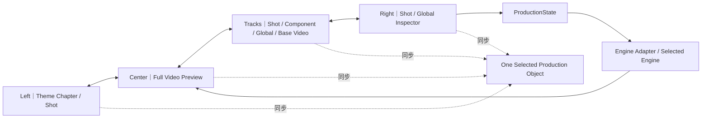

# AI DIRECTOR 智能剪辑工作台 R3

> **产品：** AI DIRECTOR｜AI 视频导演工作台 / 视频生产线  
> **版本：** R3  
> **文档状态：** Frozen Baseline｜正式冻结基线  
> **基线版本：** 1.0  
> **最后确认：** 2026-09-19  
> **范围：** Intelligent Editing｜智能剪辑的 ToC 工作台、长任务进度、章节只读预览、整片真实预览、参数化验收编辑、Inspector、Track、状态与 Stage 5 交接。

---

# 0｜文档身份

本文是 `02_AI DIRECTOR智能剪辑R3.md` 的用户层交互实现基线。

本文已经把 R2 工作台中当前仍有效的 UI / Interaction 能力完整吸收进 R3，研发无需再打开 R2 Workbench PRD 才能实现本阶段。

核心阶段边界：

```text
Topic 1
= Intelligent Editing Production｜智能剪辑生产

Topic 2–4
= Production Completed / Pending Acceptance｜生产完成 / 待验收

用户「确认完成」
= 结束 Stage 4，进入 Stage 5 Export｜READY_TO_EXPORT
```

**整个 Stage 4 不自动生成任何最终视频文件。**

---

# 1｜产品心智

用户理解：

```text
导演方案已经确认
        ↓
AI 正在智能剪辑生产
        ↓
可以提前看已完成章节，但只能看
        ↓
整片生产完成
        ↓
马上预览成片
        ↓
做少量参数精调 / 删除
        ↓
确认完成
        ↓
进入导出
```

不让用户理解：

- Codex CLI；
- Shared Engine Workspace；
- Binding Map；
- Registry；
- Engine Source Code；
- ProductionState Schema；
- Job-local Component Registry。

用户层极简，工程层完整。


## 1.1｜用户工作流与页面状态图


## 1.2｜验收工作台交互闭环



---

# 2｜统一产品名称

UI / 导航 / 页面标题 / 状态统一使用：

> **智能剪辑**

典型文案：

- 智能剪辑生产中…
- 智能剪辑未完成
- 智能剪辑完成
- 正在剪辑中
- 剪辑用时 23:48

不再显示“智能包装”。

Packaging Engine 等内部工程名可以存在于极少量引擎选择区域，但不改变阶段名。

---

# 3｜整体工作台壳层

沿用已确认的统一 Workbench 心智，不建设独立 Loading 产品：

```text
┌──────────────┬──────────────────────────────────────┬────────────────────┐
│ LEFT         │ CENTER                               │ RIGHT              │
│ Navigation   │ Workspace                            │ Inspector / Drawer │
└──────────────┴──────────────────────────────────────┴────────────────────┘
```

视觉壳层：

- Black Header；
- Black Left Navigation；
- White Center Workspace；
- White Right Inspector / Drawer；
- Orange Accent；
- Preview 服从项目画幅，默认竖屏项目为 1080 × 1920。

Topic 1 与 Topic 2–4 **使用同一产品壳层**，只改变中区内容、可编辑性和右侧状态。

---

# 4｜Stage Boundary

```text
Confirmed DirectorPlan
        ↓
Topic 1｜生产
        ↓
Theme Chapter 01 / 02 / ... Sequential Tasks
        ↓
Chapter QA
        ↓
Full ProductionState Assembly
        ↓
Engine Composition Assembly
        ↓
Global Continuity QA
        ↓
Full Candidate ProductionState
        ↓
Workbench Handoff Ready
        ↓
Packaging Job COMPLETED
        ↓
用户点击「马上预览成片」
        ↓
Topic 2–4｜Production Completed / Pending Acceptance
        ↓
Full Video Preview
        ↓
Parametric Edit / Delete Component
        ↓
Auto Save + Preview Refresh
        ↓
用户「确认完成」
        ↓
Stage 5 Export｜READY_TO_EXPORT
```

纠偏：

1. 用户进入整片 Workbench 时生产已经完成。
2. Topic 2–4 不是继续生产。
3. 不存在 `Confirm Production`。
4. 不存在预览编辑后的第二次 `Production QA`。
5. “确认完成”之后也不自动 Render；只是进入 Export 待导出状态。

---

# PART A｜Topic 1：智能剪辑生产

# 5｜Topic 1 页面骨架

```text
┌────────────────┬─────────────────────────────────────┬──────────────────────┐
│ LEFT           │ CENTER                              │ RIGHT                │
│                │                                     │                      │
│ Theme Chapter  │   ◉ 智能剪辑生产中…                 │ Packaging Engine     │
│   └ Director   │                                     │ HyperFrames ✓        │
│      Shot      │   ✓ 已完成阶段                      │ Remotion 置灰        │
│                │   ● 当前阶段                        │                      │
│ 暂不可点击      │   ○ 后续阶段                        │ Production Context   │
│                │                                     │ DirectorPlan Version │
│ 剪辑用时 01:20 │   Chapter Task Preview Rail         │ Theme Preset         │
│                │   [Ch1 ✓][Ch2 ●][Ch3 ○]             │ Core Materials       │
│                │                                     │ Mature References    │
│                │ 已完成章节可打开只读预览             │                      │
│                │                                     │ [正在剪辑中]         │
│                │                                     │ × 取消剪辑任务       │
└────────────────┴─────────────────────────────────────┴──────────────────────┘
```

---

# 6｜Topic 1 Left Navigation

显示：

```text
Theme Chapter
└─ Director Shot
```

生产中：

- 保持极简；
- 暂不可点击进入正式编辑；
- 不显示 Component 第三层；
- 不承担高频生产日志；
- 可以显示 Elapsed Timer｜已剪辑时长。

Timer 是真实本地已运行时间，不是 ETA。

---

# 7｜Topic 1 Center：真实阶段进度

中央顶部：

> **智能剪辑生产中…**

使用低频、真实、阶段式 Timeline。

只显示：

- ✓ Completed；
- ● Processing；
- ! Failed；
- ○ Pending。

不显示：

- 假百分比；
- Shot / Component 高频 Agent 日志；
- Stack Trace；
- CLI；
- Codex 内部执行细节。

典型：

```text
✓ 读取确认导演计划
✓ 锁定生产输入
✓ 加载主题预设
✓ 扫描复用机会
✓ 主题章节 01 完成
● 主题章节 02 生产中
○ 主题章节 03 等待
○ 整片生产状态装配
○ 全局连续性检查
○ 准备整片预览
```

文案与动画必须来自真实任务状态，禁止为了“看起来有进度”制造伪阶段。

---

# 8｜长任务后台 / 恢复体验

智能剪辑可能运行 20–30 分钟。

用户不需要停留在当前页面：

- 离开后 Job 继续；
- 返回智能剪辑时恢复同一个 Job；
- 不重新创建 Job；
- 不丢失已完成 Chapter；
- 页面在真实阶段变化、失败、完成时更新；
- 不要求高频事件回放。

---

# 9｜Chapter Task Preview Rail

中央底部固定提供：

> **Chapter Task Preview Rail｜主题章节任务预览条**

状态：

- Pending：灰色静态；
- Processing：轻量本地动画；
- Completed：真实 Thumbnail，可点击；
- Failed：错误状态，可重试。

章节完成后：

```text
点击缩略图
→ 新标签页
→ Read-only Chapter Stage Preview
```

不得进入正式可编辑工作台。

---

# 10｜Chapter Stage Preview UI

```text
New Tab

┌─────────────────────────────────────────┬───────────────────┐
│ CENTER                                  │ RIGHT             │
│                                         │                   │
│ Chapter Real Runtime Preview            │ Locked Inspector  │
│                                         │ 全部只读           │
├─────────────────────────────────────────┤                   │
│ Component Track｜只读                   │                   │
└─────────────────────────────────────────┴───────────────────┘
```

冻结规则：

- Preview Only；
- Read-only；
- 不可编辑；
- 不可更新 ProductionState；
- 不影响后台继续生产；
- 使用 Engine Runtime Live Code Preview；
- **不生成中间 MP4 / MOV。**

---

# 11｜Topic 1 Right Drawer

表达：

> **正在按刚刚确认的导演方案生产。**

顶部引擎：

```text
HyperFrames   ✓ 默认选中
Remotion      ○ V1 置灰不可选
```

核心信息：

- Confirmed DirectorPlan Version；
- Theme Preset；
- Core Materials；
- Mature Asset References；
- 当前任务核心生产依据。

不展示：

- AI 本次新生成组件列表；
- Job-local Registry；
- Engine Binding Map；
- 工程文件日志。

---

# 12｜Topic 1 Actions / States

## PROCESSING

- 主按钮：`正在剪辑中`，Disabled；
- 次级危险文字链：`× 取消剪辑任务`；
- 取消必须二次确认。

## Cancel UI

用户确认取消：

- 停止当前 Job；
- 不自动返回导演编排；
- 保持在智能剪辑页面；
- 中央显示“任务已取消”；
- 主操作可变为“重新开始剪辑”。

V1 不因此新增正式 `CANCELLED` Job State 枚举。

## FAILED

中央：

> **智能剪辑未完成**

显示真实失败阶段。

- 整片级失败 → `重试任务`；
- 单 Chapter 失败 → `重试当前章节`；
- FAILED 不再显示取消任务；
- Retry 使用当前锁定 Production Input Snapshot；
- 已完成 Chapter 保留。

## COMPLETED

必须满足完整 Completion Gates。

中央：

> **智能剪辑完成**

Timer 停止。

右侧主按钮：

> **马上预览成片**

用户不点击就保持完成状态，不自动跳转。

**COMPLETED 也不生成视频文件。**

---

# PART B｜Topic 2：整片真实预览与待验收工作台

# 13｜Topic 2 Positioning

进入时：

> **Production Completed / Pending Acceptance｜生产完成 / 待验收**

不是章节预览，不是生产中。

---

# 14｜Topic 2–4 UI Skeleton

```text
┌──────────────────────────────────────────────────────────────────────────┐
│ TOP BAR｜Project / Auto Save / 「确认完成」                              │
├────────────────┬──────────────────────────────────────┬──────────────────┤
│ LEFT           │ CENTER                               │ RIGHT            │
│                │                                      │                  │
│ Theme Chapter  │ Full Video Real Preview              │ Shot | Global    │
│   └ Director   │                                      │                  │
│      Shot      ├──────────────────────────────────────┤ Character Layout │
│                │ 1. Shot Navigation Track             │                  │
│ 可点击定位      │ 2. Current Shot Component Track      │ Component List   │
│                │ 3. Global Packaging Track            │      ↕           │
│                │ 4. Base Video Track                  │ Component Config │
└────────────────┴──────────────────────────────────────┴──────────────────┘
```

---

# 15｜Left Navigation

保持两级：

```text
Theme Chapter
└─ Director Shot
```

进入整片 Workbench 后恢复可点击。

禁止新增：

- Component 第三层树；
- Asset 第三层树；
- ProductionState 技术节点树。

点击 Shot：

- Preview 定位；
- Shot Navigation Track 同步；
- Current Shot Component Track 切换；
- Right Inspector 切换当前 Shot。

---

# 16｜Full Video Real Preview

支持：

- 从头连续播放；
- Play / Pause；
- Seek；
- 跨 Chapter / Shot；
- 点击左侧 Shot 定位；
- 点击 Preview 中已有组件选择；
- Preview 与 Track / Inspector 同步。

它是：

> **Engine Runtime 本地真实预览。**

不是自动生成的 MOV/MP4 文件。

---

# 17｜四轨结构

## Track 1｜Shot Navigation Track

承担：

- 当前 Shot 定位；
- 相邻 Shot 导航；
- 不做帧级 NLE 编辑。

## Track 2｜Current Shot Component Track

核心生产轨：

- 显示当前 Shot Components / Empty Slots；
- 支持选择；
- Timing / Start / End / Duration；
- Layer Order；
- Delete Component。

组件可重叠。

`Timing` 与 `Layer Order` 独立。

组件 Timing 不得越出当前 Shot 边界。

## Track 3｜Global Packaging Track

只显示当前项目启用的：

- Subtitle；
- Chapter Progress。

Logo / 贴片 / 角标 / 普通图片视频不进入 Global Packaging Track；它们是普通 Media Components。

## Track 4｜Base Video Track

只作为基础视频事实与预览轨。

Stage 4 不在此对 Base Video 做 NLE 剪辑。

---

# 18｜Selection Sync｜单一选中对象

冻结：

```text
Left Shot
   ↕
Full Video Preview
   ↕
Component Track
   ↕
Inspector

= One Selected Production Object
```

任何区域选择对象，都同步其他区域。

不得同时形成多套互相冲突的选中状态。

---

# 19｜Right Inspector 顶级模式

只保留：

```text
Shot
Global
```

不得新增：

- Component 一级页；
- Asset 一级页；
- ProductionState 一级页。

---

# 20｜Shot Inspector

固定结构：

```text
Shot
├─ Character Layout
└─ Component List ↔ Selected Component Config
```

## 20.1 Character Layout

- 当前 Shot 专属；
- 只影响当前 Shot；
- 不自动修改其他 Shot；
- 不自动重排其他 Component；
- 所有修改实时写入当前 ProductionState 并刷新 Preview。

## 20.2 Component List

展示当前 Shot 全部 Component Slot / Instance。

支持：

- 选择；
- Delete；
- 列表 ↔ 当前组件配置切换。

不提供：

- Replace；
- Generate；
- Quick Create；
- New Slot。

---

# 21｜Selected Component Config

Inspector 根据 `Editable Contract` 动态展示组件实际支持项。

能力组：

## 01 Layout Direction

只在组件真实支持多个方向时显示。

示例：Horizontal / Vertical。

## 02 Content & Media

支持合同内：

- 标题；
- 文案；
- 数据；
- 标签；
- 内容节点；
- Media Slot；
- Media Replacement；
- Text Size by Semantic Role。

注意：

> **Media Replacement ≠ Replace Component。**

前者可以由组件合同支持；后者 V1 不开放。

Typography 只开放语义档位，例如 Small / Medium / Large，不开放任意 px、字重、行高、字距。

## 03 Color & Layout

可包括：

- Follow Project Theme；
- 支持的 Instance Override；
- Position；
- Size / Scale；
- Position Preset；
- 非结构 Variant。

必须消费 Theme Preset Visual DNA，不建立组件私有随意主题系统。

## 04 Animation Settings

只使用业务语义：

- Slow / Medium / Fast；
- 累积保留；
- 聚焦当前；
- 单步切换；
- 组件真实支持的其他离散语义。

禁止暴露：

- Keyframe；
- Easing；
- Spring；
- Engine 底层动画参数。

---

# 22｜Workbench Common Controls

稳定公共控制：

- Timing；
- Position；
- Size；
- Layer Order；
- Visibility；
- Theme Inheritance。

职责尽量不重复：

```text
Component Track
→ Timing / Duration / Layer Order

Inspector
→ Position / Size / Content / Media / Layout / Theme / Animation
```

只展示真实可执行能力。

---

# 23｜Global Inspector

结构：

```text
Global
├─ Global Settings
└─ Global Components ↔ Selected Global Component Config
```

Global Components 当前只有：

- Subtitle；
- Chapter Progress。

Global Settings 只承载当前已实现的项目级可调参数，不建立自由设计器。

Global 参数修改：

- 通过 ProductionState；
- Engine Adapter 刷新真实 Preview；
- 不调用 Codex；
- 不自动重新启动整片智能剪辑 Job。

---

# 24｜Parametric Edit

V1 正式允许：

> **合同内参数化精调。**

链路：

```text
User Edit
→ ProductionState
→ Engine Adapter
→ Selected Engine
→ Preview Refresh
```

不调用 Codex。

---

# 25｜Delete Component

V1 唯一开放的轻量结构动作：

> **Delete Component Instance。**

删除后：

- Slot Content 保留；
- Slot 身份保留；
- Timing 保留；
- Layer 保留；
- Position / Size 保留；
- Track 显示 Empty Slot。

V1 Empty Slot：

> **Read-only。**

不得出现“在此生成组件 / 替换组件”等入口。

---

# 26｜Structural Edit

R3 V1 ToC Workbench：

> **不开放 Structural Edit。**

前台无：

- AI 修改组件结构；
- 重新生成；
- 替换组件；
- 新增 Slot；
- 新布局机制；
- 新动画机制；
- 当前 Shot 局部重新生成。

底层可以保留未来结构性修改能力，但不得露出用户入口。

---

# 27｜Auto Save

采用：

> **改即生效 + 自动保存。**

不新增：

- 保存当前组件；
- 应用修改；
- 提交当前 Shot。

ProductionState 是当前业务权威。

---

# 28｜“确认完成”

Topic 2–4 唯一正式最终业务动作：

> **确认完成**

用户心智：

```text
AI 已经完成整片生产
→ 我看成片
→ 做必要轻量精调
→ 满意
→ 确认完成
```

点击后：

```text
Current ProductionState
→ Freeze Final ProductionState Snapshot
→ Exit Stage 4
→ Enter Stage 5 Export
→ READY_TO_EXPORT
```

明确不发生：

- Render；
- Encode；
- MP4 / MOV 文件创建；
- Alpha MOV 创建；
- Export Job 创建。

进入 Stage 5 后仍保持 `READY_TO_EXPORT`。只有用户在 Export 页面明确点击：

> **开始导出**

才允许创建 Export Job 并开始生成视频文件。

---

# 29｜Stage 4 文件生成禁令

以下所有 UI 状态均不得因为“完成”自动生成视频文件：

- Chapter Preview Ready；
- Packaging Job COMPLETED；
- “智能剪辑完成”；
- “马上预览成片”；
- Production Completed / Pending Acceptance；
- Auto Save；
- “确认完成”。

Stage 4 只使用本地代码 / Engine Runtime Preview。

---

# 30｜UI Components / Interaction Reuse Contract

R3 已吸收并继续使用以下成熟工作台能力：

- Shot / Global 一级模式；
- 列表 ↔ 配置切换；
- Selection Sync；
- Scroll Area；
- 可见滚动条；
- Resizable Split Pane；
- 统一选中态；
- Player / Track / Inspector 联动；
- 统一 Button / Input / Label / Icon 规范；
- Auto Save。

这些内容已经是本文的一部分，不需要研发再读 R2 获取授权。

---

# 31｜错误与恢复

## Topic 1

- Chapter Failure：显示失败 Chapter；
- Retry Chapter；
- 保留已完成 Chapter；
- 使用锁定 Snapshot。

## Topic 2–4

本阶段主要是本地参数化编辑。

如果 Engine Preview 刷新失败：

- 不静默修改 ProductionState；
- 保留上一个可用 Preview；
- 展示轻量错误状态；
- 技术恢复不得自动进入 Structural Edit。

---

# 32｜Accessibility / Reading Load 基础规则

工作台不通过堆叠技术信息表达“专业”。

优先：

- 当前任务；
- 当前对象；
- 当前状态；
- 当前可执行动作。

生产中不展示高频 Agent 日志；待验收时不展示工程 Schema。

---

# 33｜Deterministic QA Checklist

## Topic 1

- [ ] 页面仍是左中右工作台，不是单独 Loading 页。
- [ ] 文案统一“智能剪辑”。
- [ ] 左侧生产期不可进入编辑。
- [ ] 中央显示真实阶段，不是假百分比。
- [ ] 用户可离开并恢复同 Job。
- [ ] Chapter Rail 存在。
- [ ] Chapter Preview 新标签、只读。
- [ ] Chapter Preview 不生成 MP4/MOV。
- [ ] HyperFrames 默认，Remotion V1 置灰。
- [ ] Cancel 二次确认。
- [ ] Failed 支持整片 / 章节重试。
- [ ] Completed CTA = 马上预览成片。
- [ ] Completed 不自动导出。

## Topic 2–4

- [ ] 状态 = Production Completed / Pending Acceptance。
- [ ] 左侧仅 Chapter → Shot。
- [ ] 中上整片真实 Preview。
- [ ] 下方四轨齐全。
- [ ] Right 一级仅 Shot / Global。
- [ ] Selection Sync 唯一。
- [ ] Editable Contract 驱动配置项。
- [ ] Parametric Edit 不调用 Codex。
- [ ] V1 不 Replace / Generate / Quick Create / Structural Edit。
- [ ] Delete 后 Slot Content 保留。
- [ ] Empty Slot 只读。
- [ ] Auto Save。
- [ ] 无后置 Production QA。
- [ ] 无 Confirm Production。
- [ ] 最终动作 = 确认完成。
- [ ] 确认完成不 Render、不创建 Export Job。

---

# 34｜Frozen Invariants

1. Topic 1 是生产阶段。
2. Topic 2–4 是生产完成后的待验收阶段。
3. 同一左中右 Workbench 壳层贯穿 Stage 4。
4. 章节阶段预览只读。
5. V1 不开放 Structural Edit。
6. V1 不 Replace / Generate / Quick Create。
7. V1 允许 Parametric Edit + Delete Component。
8. Track / Preview / Inspector Selection Sync 唯一。
9. Right 一级模式只有 Shot / Global。
10. Global Packaging 当前只有 Subtitle / Chapter Progress。
11. ProductionState 是 Handoff 后权威。
12. Parametric Edit 不调用 Codex。
13. Auto Save = 改即生效。
14. 不存在 Confirm Production。
15. 不存在后置 Production QA。
16. Topic 2–4 最终动作只有“确认完成”。
17. “确认完成”只冻结最终 ProductionState。
18. Stage 4 任何完成状态都不得自动生成视频文件。

---

# 35｜Baseline Effect

本文生效后，历史工作台中“预览完成后确认生产 → 再 QA → 再 Render”、V1 Replace / Generate / Quick Create、Stage 4 自动导出等旧语义全部失效。研发不得通过旧 R2 UI 文档恢复这些能力。
