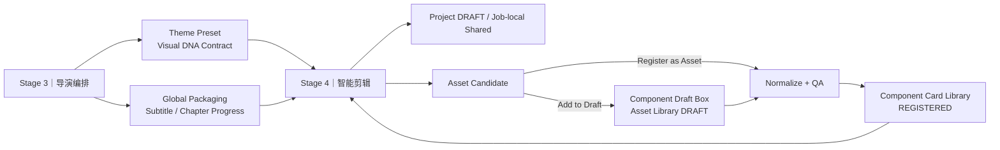
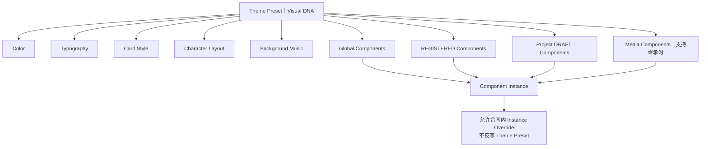
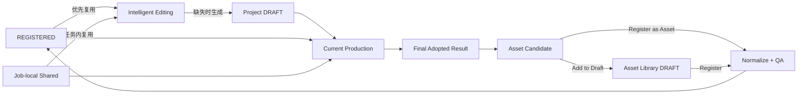

# AI DIRECTOR 主题包装资产库 R3

> **产品：** AI DIRECTOR｜AI 视频导演工作台 / 视频生产线  
> **版本：** R3  
> **文档状态：** Frozen Baseline｜正式冻结基线  
> **基线版本：** 1.0  
> **最后确认：** 2026-09-19  
> **范围：** Theme Preset｜主题预设完整 Visual DNA Contract + Global Packaging｜全局包装 + Component Card Library｜组件卡片库 + Component Draft Box｜组件草稿箱 + Component Asset Model / Preview / Creation / Registration / Production / Export 衔接。

---

# 0｜文档身份

本文是 R3 **Theme Packaging Asset Library｜主题包装资产库** 的完整事实源。

特别说明：

> **Theme Preset｜主题预设完整 Visual DNA Contract 已正式并入本文。**

R3 正式交付不再依赖独立的第七份 Theme Preset 基线文档。

本文已完整吸收当前仍有效的 R2 组件资产库成熟能力和 R3 已冻结资产治理规则，研发无需再读取 R2 才能实现资产库。

---

# 1｜产品定位

Theme Packaging Asset Library 是横向系统，不是视频生产的第六个生命周期阶段。

```text
Theme Packaging Asset Library
        ↙                         ↘
Director Arrangement        Intelligent Editing
主题选择 / 全局组件选择       成熟资产复用 / 缺失资产生成
                                   ↓
                                Export
                                   ↓
                           Asset Candidate 沉淀
```

解决三件事：

```text
1. Visual DNA｜视觉基因
   → Theme Preset

2. Reusable Production Assets｜成熟复用资产
   → Global Packaging
   → Component Card Library

3. Long-term Asset Incubation｜长期资产孵化
   → Component Draft Box
```

生产可以从 `0 REGISTERED Asset` 开始。

资产库的价值是：

> **降低未来成本、提高稳定性、保持视觉一致性、形成跨项目复用飞轮。**

不是生产门槛。

Theme Packaging Asset Library 是**跨项目共享系统**，不作为单个 Project Workspace 的一级目录，也不要求把 REGISTERED Asset 复制进项目文件夹；当前项目通过稳定引用消费共享资产。


## 1.1｜资产库横向架构图



## 1.2｜Theme Preset 继承关系图



---

# 2｜一级信息架构

左侧一级导航固定四类：

```text
Theme Packaging Asset Library
│
├─ 01 Theme Preset｜主题预设
├─ 02 Global Packaging｜全局包装
├─ 03 Component Card Library｜组件卡片库
└─ 04 Component Draft Box｜组件草稿箱
```

四类业务本质：

| 模块 | 本质 |
|---|---|
| Theme Preset | Visual DNA Contract Reader｜视觉基因合同阅读器 |
| Global Packaging | `scope = GLOBAL` 的 REGISTERED Component Assets |
| Component Card Library | 普通 REGISTERED Component Assets 成熟资产池 |
| Component Draft Box | Asset Library DRAFT 长期草稿治理区 |

---

# PART A｜Theme Preset｜主题预设

# 3｜Theme Preset 正式定义

> **Theme Preset = 视频包装的 Visual DNA Contract｜视觉基因合同。**

它定义整条视频包装层的共同视觉基因，让后续：

- Global Components；
- Component Cards；
- Media Components；
- Project DRAFT Components；

在支持 Theme Inheritance 时呈现统一视觉语言。

它不是：

- 组件集合；
- 完整页面模板；
- 一套固定组件 ID；
- Runtime；
- Global Packaging；
- 动画组件库。

正式合同形态：

> **规范模板 + 可选配置引用。**

---

# 4｜Theme Preset 五章合同【FROZEN】

当前 Visual DNA 只包含五章：

```text
01 Color｜颜色
02 Typography｜字体字号
03 Card Style｜卡片风格
04 Character Layout｜人物布局
05 Background Music｜背景音乐
```

明确不包含：

- Motion Language｜动效语言；
- Subtitle｜字幕；
- Chapter Progress｜章节进度；
- Logo / 角标 / 贴片；
- 普通 Media；
- Component Animation Behavior。

`Motion Language` 已从 Theme Preset 正式删除。

组件仍可以拥有自己的动画行为与 Animation Settings，这不与上述规则冲突。

---

# 5｜01 Color｜颜色 DNA

Color DNA 定义项目级语义颜色，而不是为每个组件开放自由调色板。

至少允许表达：

- Background / Canvas；
- Surface / Card Surface；
- Primary Text；
- Secondary Text；
- Accent / Theme Color；
- Border / Divider；
- 必要状态色引用。

组件消费：

```text
Theme Color DNA
→ Component Theme Mapping
→ Component Instance
```

原则：

- 组件不再使用旧 Blue / Orange / Red / Purple 四色硬编码合同；
- 组件可在支持的范围内 Instance Override；
- Override 不反向修改 Theme Preset；
- Theme Token 命名与具体 CSS / Engine Token 映射属于实现层。

---

# 6｜02 Typography｜字体字号 DNA

当前默认字体：

> **PingFang SC｜苹方**

支持：

- 引用本地字体；
- 用户上传 / 指定可用字体资源；
- 通过稳定 Font Reference 使用。

Typography DNA 关注语义层级，而不是开放复杂排版工程参数。

建议语义角色：

- Display / Hero；
- Title；
- Section Title；
- Body；
- Caption / Label；
- Data / Number（如需要）。

Theme 负责统一层级气质；组件侧只允许声明支持的离散字号档位，例如：

> Small / Medium / Large

V1 不开放任意：

- px；
- 字重；
- 行高；
- 字间距；
- 逐节点自由排版系统。

---

# 7｜03 Card Style｜卡片风格 DNA

R3 当前只保留两个正式主题风格：

1. **高级液态玻璃**
2. **白色商务简洁**

不继续扩展更多主题风格，除非形成新的明确 Delta。

## 7.1 高级液态玻璃

当前视觉合同：

- 深色背景优先；
- 透明 / 半透明 Card Surface；
- 轻量 Blur；
- 低对比边框；
- 简单、克制的投影；
- 小到中小圆角；
- 垂直空间更松，有呼吸感；
- 主题强调色稀疏使用；
- 避免复杂渐变；
- 避免强发光；
- 避免重阴影；
- 避免过大圆角；
- 按钮可采用更明显的大圆角。

目标气质：

> **高级、克制、轻材质感，而不是炫技玻璃。**

## 7.2 白色商务简洁

当前视觉合同：

- 白色 / 浅色背景；
- 白色实体卡片；
- 小到中小圆角；
- 极轻投影；
- 充分留白；
- 强调色使用纯色；
- 左侧需要强调线时使用细的纯蓝色竖线；
- 不使用渐变蓝线；
- 不使用复杂光影；
- 不使用发光；
- 不使用重阴影；
- 不使用过大圆角；
- 按钮整体保持简单、商务。

目标气质：

> **白、简、商务、清晰、低视觉噪声。**

## 7.3 Card Style 合同内容

Card Style 可以通过语义 Token 表达：

- Surface Type；
- Radius Level；
- Border Strength；
- Shadow Strength；
- Blur Level（如适用）；
- Spacing Density；
- Accent Treatment；
- Button Shape Tendency。

V1 不要求用户直接操作底层任意 CSS Token。

---

# 8｜04 Character Layout｜人物布局 DNA

Character Layout 是 Theme Preset 的正式 Visual DNA 组成部分。

它定义：

> **整条视频可选择 / 复用的人物布局视觉规范与布局预设。**

UI 采用：

> **Graybox / Low-fidelity Layout Preview｜灰模低保真人物布局预览。**

当前已确认支持的布局语义包括：

- Split Left｜人物左侧分屏；
- Split Right｜人物右侧分屏；
- Small Portrait / Rounded Rectangle｜小框人物；
- Full Screen｜全屏人物；
- 其他已经真实实现并登记的布局预设。

本合同不强制固定未来布局数量。

Character Layout Theme Preset 与 Shot Character Strategy 的关系：

```text
Theme Preset Character Layout DNA
= 可用布局语言 / 视觉规范

Director Shot Character Strategy
= 当前 Shot 选哪种高层人物策略

Intelligent Editing
= 解析为真实可执行人物布局实例
```

普通 Component **不预绑定人物安全区**，也不建立 AVOID / OVERLAY / FREE 等硬合同。

人物与组件空间关系在具体 Shot 中由 Director Arrangement + Intelligent Editing 决定。

---

# 9｜05 Background Music｜背景音乐 DNA

Background Music 是 Theme Preset 当前第五章。

正式规则：

> **默认无背景音乐。**

允许：

- Upload / Reference Local Audio；
- 保存稳定音频引用；
- 项目级启用 / 不启用；
- 必要的基础存在性 / 可加载验证。

当前不做：

- BGM 风格分类库；
- AI 音乐推荐系统；
- 情绪标签复杂体系；
- 完整音量自动化编辑器；
- 音轨管理器；
- 多轨 Audio Production。

Theme Preset 只负责：

> **该项目是否有 BGM、引用哪条可用音频。**

---

# 10｜Theme Preset Reader UI

Theme Preset 页面是：

> **Visual DNA Contract Reader｜视觉基因合同阅读器。**

不是自由设计器。

建议结构：

```text
Theme Preset
├─ Preset Identity / Name
├─ Preview
├─ 01 Color
├─ 02 Typography
├─ 03 Card Style
├─ 04 Character Layout
└─ 05 Background Music
```

用户重点是：

- 看懂当前 Visual DNA；
- 选择主题预设；
- 查看 / 调整被允许的少量项目级引用；
- 预览整体气质。

不得把 Theme Preset 页面做成 CSS Design Token IDE。

---

# 11｜Theme Inheritance

正式公式：

```text
Theme Preset Default
+
Component Instance Override
```

实例覆盖：

- 只影响当前实例；
- 不反写 Theme Preset；
- 不默认影响其他实例；
- 不把单次 Instance Override 变成长期资产默认值。

核心原则：

> **改啥动啥。**

---

# PART B｜Global Packaging

# 12｜Global Packaging 正式定义

Global Packaging 本质：

> **已经 REGISTERED、`scope = GLOBAL` 的 Component Assets。**

不建立第二套：

- Global Asset Model；
- Global Runtime；
- Global Component Definition；
- Global Preview System。

底层仍使用统一 Component Asset Model。

---

# 13｜V1 Global Packaging 成员【FROZEN】

当前只有：

1. **Chapter Progress｜主题章节进度**
2. **Subtitle｜字幕**

Logo、角标、贴片、一般图片、视频、富媒体：

> **均不是 Global Packaging 正式类型。**

这些走普通 Media Component / Media Asset 逻辑。

---

# 14｜Global Packaging 与 Director Arrangement

资产库页面回答：

> 系统当前有哪些正式 Global Components。

Director Arrangement Stage 3 回答：

> 当前项目启用哪些 Global Components。

V1 项目选择：

```text
Chapter Progress   ON / OFF
Subtitle           ON / OFF
```

这是引用 / 启用，不在导演阶段重新设计组件。

---

# 15｜Global Packaging UI

V1 只有两个资产，保持极简：

```text
Global Packaging

┌──────────────────────┐  ┌──────────────────────┐
│ Real Preview / Poster│  │ Real Preview / Poster│
│ Chapter Progress     │  │ Subtitle             │
│ REGISTERED           │  │ REGISTERED           │
└──────────────────────┘  └──────────────────────┘
```

暂不增加 Search / Tag 多层分类。

点击后进入统一 Registered Component Detail Shell。

---

# PART C｜Core Component Asset Model

# 16｜Component Definition 五层模型

R3 正式保留并吸收成熟五层模型：

```text
Component Definition
│
├─ 01 Identity
├─ 02 Semantic
├─ 03 Content
├─ 04 Workbench Capability
└─ 05 Runtime
```

研发不需要再读取 R2 获取字段语义。

---

# 17｜Identity

回答：

> **这个 Component Asset 是谁。**

至少包含：

- Component ID；
- Name；
- Business Definition Version；
- Status；
- Preview / Poster；
- Type / Taxonomy；
- Description；
- Example。

---

# 18｜Semantic

回答：

> **这个资产适合表达什么。**

至少：

- Pattern｜信息关系；
- Use Cases；
- Unsuitable Use Cases；
- Cardinality；
- Depth；
- Density；
- Tags。

用于：

- Asset Discovery；
- Capability Index；
- Intelligent Editing Asset Resolution；
- Mature Asset Discovery。

不得只按 Name / Tag 相似度判断结构兼容性。

---

# 19｜Content

回答：

> **这个资产能承载什么内容。**

至少：

- Content Schema；
- Required / Optional Fields；
- Primary / Secondary / Optional Nodes；
- min / max Cardinality；
- Dynamic Reflow；
- Content Constraints；
- Media Slots；
- Text Roles；
- Aspect Ratio Support；
- Variant / Layout Capability；
- Component Bounds。

正式原则：

```text
Component Definition
= 能力边界

Content Tree / Instance Content
= 当前真实内容
```

不为了适配组件自动编造内容。

---

# 20｜Workbench Capability

回答：

> **进入真实 Preview / Production 后哪些业务配置可调。**

V1 四组：

```text
01 Layout Direction
02 Content & Media
03 Color & Layout
04 Animation Settings
```

Typography Controls 放在 `Content & Media` 中，不再新增第五组。

只声明真实支持能力。

未支持：

> 不显示，或明确标记未支持。

---

# 21｜Runtime

R3 多引擎结构：

```text
Runtime
│
├─ Engine Implementations
│   ├─ HyperFrames Child｜V1 Primary
│   └─ Remotion Child｜Expansion
├─ Engine Binding Maps
├─ Theme / Visual DNA Mapping
├─ Motion Behavior
├─ Dependencies
├─ Runtime Capability
├─ Preview Capability
└─ Render Capability
```

资产身份与具体 Engine 实现解耦。

---

# 22｜Parent Asset × Engine Child

```text
Parent Asset
CMP-001
│
├─ CMP-001-HF
│   HyperFrames Implementation
│
└─ CMP-001-RM
    Remotion Implementation
```

Parent Asset 面向：

- 人类业务识别；
- Semantic；
- Content；
- Workbench Capability；
- Asset Library；
- Capability Index；
- Mature Asset Reference。

Engine Child 面向：

- Intelligent Editing；
- Engine Adapter；
- Runtime / Preview / Render。

---

# 23｜版本独立与 Engine Support

Parent Business Definition Version 与 Engine Implementation Version 独立演进。

Job 实际使用时锁定：

```text
Parent Asset ID
+ Business Definition Version
+ Engine Child ID
+ Implementation Version
```

Engine Support 规则：

> **只有真实 Child Implementation 存在并通过对应 Runtime / Preview / Render QA，才能声明 VERIFIED。**

不能把“理论可移植”写成正式支持。

---

# 24｜Definition / Asset / Instance 分离

```text
Component Definition
= 有什么能力

Component Asset
= 可复用资产身份

Component Instance
= 当前项目实际用了什么
```

Instance 修改默认不回写 Asset。

---

# PART D｜资产角色与状态

# 25｜五类对象必须严格分开

## 25.1 REGISTERED

长期成熟跨项目资产。

可：

- Registry；
- Capability Index；
- 未来 Asset Resolution；
- 跨项目复用；
- Global Packaging / Component Card Library。

不可：

- 当前项目静默覆盖正式版本；
- 声明未验证 Engine；
- 把 Instance Override 反写资产定义。

## 25.2 Asset Library DRAFT

已进入长期资产治理空间，但未正式注册。

只出现在：

> **Component Draft Box**

## 25.3 Project DRAFT

智能剪辑为当前视频按需创建的项目级组件实现。

- 可直接服务当前生产；
- 不要求注册；
- 不自动进入 Draft Box；
- 目标首先是完成当前项目。

## 25.4 Asset Candidate

真实生产、最终采用后，系统筛选出的潜在长期复用候选。

它：

- 不是 Asset Library DRAFT；
- 不是 REGISTERED；
- 不是 Project DRAFT 本身；
- 等待用户决定是否沉淀。

每个 Candidate 在进入候选池时，系统必须补齐可理解的资产信息：

- Component Name｜组件名称；
- Description｜组件描述；
- Primary Purpose｜主要用途；
- Typical Use Cases｜适用场景；
- Tags｜标签；
- Suggested Category｜建议分类；
- Category Type｜Existing Category / Proposed New Category；
- Category Rationale｜分类理由。

分类建议遵循：

```text
Asset Candidate
        ↓
Semantic Match / Dedup Existing Categories
        ↓
├─ 有合理现有分类 → Suggested Existing Category
└─ 无合理现有分类 → Proposed New Category
```

提出新分类前必须先做 Semantic Deduplication｜语义去重，避免产生“人物卡 / 人物介绍 / 专家介绍”等语义重复分类。

若为 Proposed New Category，还必须给出：

- Proposed Category Name｜建议分类名称；
- Category Definition｜分类定义；
- Typical Use｜典型用途；
- Include Scope｜包含范围；
- Exclude Scope｜不包含范围；
- Recommended Tags｜推荐标签。

路径：

```text
Asset Candidate
├─ Add to Draft → Asset Library DRAFT
└─ Register as Asset
      ├─ Existing Category → Normalize + QA → REGISTERED
      └─ Proposed New Category
           → 用户确认分类建议
           → Normalize + QA
           → PASS 后原子完成 Create Category + REGISTERED
```

两个动作并列，不要求先 Draft 再注册。

AI 可以自动生成分类建议、描述、标签和理由，但不得无用户确认自动扩展 Taxonomy。

当前没有 Ignore Button。

不操作：

> Candidate 保持未处理。

## 25.5 Job-local Shared Component

只服务当前 Project Packaging Job 的临时复用对象。

- 不进 Draft Box；
- 不自动 Candidate；
- 不自动 Registered；
- 生命周期与当前 Job 绑定。

---

# 26｜状态总图




```text
REGISTERED
    ↓ 未来优先复用
Intelligent Editing
    ├─ Reuse REGISTERED
    ├─ Reuse Job-local
    └─ Generate Missing → Project DRAFT
                      ↓
                 Current Production
                      ↓
                 Final Adopted Result
                      ↓
                 Asset Candidate
                 ├─ Add to Draft
                 │      ↓
                 │ Asset Library DRAFT
                 │      ↓
                 │   Register
                 │      ↓
                 └──→ Normalize + QA → REGISTERED
```

主动建设路径：

```text
New Component
→ Codex
→ Asset Library DRAFT
→ Draft Box
→ Preview / Revise / QA
→ Register
→ REGISTERED
```

---

# PART E｜Component Card Library

# 27｜正式定位

只展示：

> **REGISTERED Component Assets。**

不是：

- Project DRAFT 区；
- Candidate 区；
- Instance Editor；
- 生产前置 Gate。

---

# 28｜Taxonomy【FROZEN】

Component Card Library 本身即 Animation Components，不存在“动画组件”中间层。

R3 V1 提供 10 个 Seed Categories｜初始化直接二级分类：

1. 核心观点｜Key Statement
2. 核心数据｜KPI Number
3. 多点并列｜Multi Point
4. 逐项导航｜Progressive Navigation
5. 步骤流程｜Step Flow
6. 逻辑节点｜Logic Node Graph
7. 对比｜Comparison
8. 数据图表｜Data Chart
9. 证据｜Evidence
10. 媒体自由组件｜Media

这 10 类是初始化分类集，不是永久封闭的分类上限。

Taxonomy 采用 Controlled Extension｜受控扩展：

```text
真实项目产生 Asset Candidate
        ↓
优先匹配现有分类 + Semantic Deduplication
        ↓
├─ 匹配成功 → 归入现有分类
└─ 无合理分类 → AI 提出 Proposed New Category
                   ↓
                用户确认
                   ↓
          注册 QA 通过后创建分类
                   ↓
             Registered Asset
```

新分类不得由 AI 静默创建；只有用户明确确认后，系统才能修改正式 Taxonomy。

每个正式 Category 至少保存：

- Category ID；
- Category Name；
- Description；
- Typical Use；
- Include Scope；
- Exclude Scope；
- Tags；
- Source Candidate（如由真实项目演进产生）；
- Created At。

当前：

- 无 Featured｜精选推荐；
- 无 Animation Components 中间层；
- Global Packaging 不重复出现在分类内；
- Character Layout 不作为组件分类；
- Draft Box 不作为组件分类。

Scene-type Components 不预建独立入口；真实资产出现后，如现有分类无法合理承载，再通过上述受控扩展机制决定是否新增分类。

---

# 29｜Browse UI

左侧展开式分类，右侧工作区：

```text
┌────────────────────────┬────────────────────────────────────────────┐
│ Left Navigation        │ Component Card Library                     │
│                        │                                            │
│ 主题预设                │ Search | Tags | Filter | New Component    │
│ 全局包装                │                         List | Grid        │
│ 组件卡片库 ▼            │                                            │
│ ├ 核心观点              │ Preview | Name | Description | Motion     │
│ ├ 核心数据              │ Preview | Name | Description | Tags       │
│ ├ ...                   │                                            │
│ └ 媒体自由组件          │                                            │
│ 组件草稿箱 [N]          │                                            │
└────────────────────────┴────────────────────────────────────────────┘
```

Toolbar 固定：

- Search；
- Tags；
- 多选 / 筛选；
- New Component；
- List / Grid。

默认：

> **List。**

用户确认并成功创建的正式新分类，按当前 Taxonomy 动态加入 Component Card Library 左侧二级分类列表；不得要求重新发布固定导航代码后才能出现。

---

# 30｜Component Detail Shell

Global / Registered / Draft 最大化共用同一详情壳层：

```text
┌──────────────────────────────────────┬──────────────────────┐
│ Main Detail                          │ Preview Controls     │
│                                      │                      │
│ Real Runtime Preview                 │ 01 Layout Direction │
│                                      │ 02 Content & Media  │
├──────────────────────────────────────┤ 03 Color & Layout   │
│ Component Information                │ 04 Animation        │
│                                      │                      │
│ Identity / Semantic / Content        │ Reset               │
│ Workbench Capability / Runtime       │ Boundary Preview    │
│ Engine Support / Provenance          │                      │
│                                      │                      │
│ [去 Codex 中修改]                    │                      │
└──────────────────────────────────────┴──────────────────────┘
```

列表 Poster 只用于快速浏览；正式详情优先真实 Runtime Preview。

---

# 31｜Preview Controls

定位：

> **试参数、看效果。**

不是正式 Definition 编辑器，也不是项目 ProductionState Inspector。

边界：

```text
Component Definition = Read-only Facts
Preview Instance = 当前详情页临时试填
Project Instance = 智能剪辑 / Workbench ProductionState
```

Preview Instance：

- 不落盘正式 Definition；
- 不污染 Project ProductionState；
- 页面刷新后可恢复 Example Default。

四组能力：

1. Layout Direction；
2. Content & Media；
3. Color & Layout；
4. Animation Settings。

只展示真实支持项。

---

# 32｜通用组件能力下限

正式 Registered Component 原则上至少具备：

## Position

- X / Y；
- 可有 Position Preset；
- Preset 不替代微调。

## Size

- 整组件等比 Scale；
- V1 上限沿用 2×；
- 默认大小不因开放缩放而改变。

## Theme

- 消费当前 Theme Preset Color / Typography / Card Style DNA；
- 具体内部映射由组件自身 Theme Mapping 实现；
- 不恢复旧四色硬编码。

普通 Component 不预绑定人物 Layout / Safe Zone。

---

# 33｜Shared Preview Capability

所有真实动画 Preview 使用共享实现。

R3 升级为 Engine-independent：

```text
Parent Asset
→ Selected Verified Engine Child
→ Engine Adapter
→ Shared Preview Capability
→ Real Runtime Preview
```

V1 Primary Engine = HyperFrames。

共享能力至少负责：

- Child Implementation 解析；
- Runtime 元信息；
- Preview Surface；
- Runtime 装配；
- Error Fallback；
- Aspect Ratio；
- Background Surface；
- Playback Controls；
- QA Hooks；
- Poster / Still Capture 的一致来源。

原则：

> **共享 Preview 实现 ≠ 共享可写状态。**

各页面 Preview Instance 必须隔离。

---

# PART F｜Codex 创建 / 修改

# 34｜分工

> **Codex 负责创建与结构性修改；Asset Library 负责浏览、预览、试填与治理。**

资产库不建设完整代码 IDE。

---

# 35｜New Component

Component Card Library 右上保留：

> **New Component｜新建组件**

流程：

```text
New Component
→ Generate Codex Handoff
→ Reuse First
→ 查重 / Shared Elements / Element Factory / Mature Sources
→ Build Missing Capability if Needed
→ Asset Library DRAFT
→ Component Draft Box
```

主动新建组件默认进入长期 Draft Box，而不是 Project DRAFT。

---

# 36｜去 Codex 中修改

Registered / Draft Detail 均可提供：

> **去 Codex 中修改**

Handoff 至少携带：

- Component ID；
- Business Definition Version；
- Engine Child / Implementation Version；
- 当前事实源；
- Scope；
- Keep / Frozen Boundary；
- 用户修改目标。

Codex 先复述范围，再执行。

---

# 37｜Registered Asset Protection

Registered 结构性修改：

```text
Registered Current Version
→ Structural Edit
→ Candidate / Draft Version
→ Validate
→ 当前项目可先使用
→ 再决定是否注册新版本
```

绝不静默覆盖历史正式版本。

---

# PART G｜Component Draft Box

# 38｜正式身份

Draft Box 只承载：

> **Asset Library DRAFT。**

不承载：

- Project DRAFT；
- Job-local Shared；
- Asset Candidate；
- REGISTERED。

---

# 39｜两条进入路径

生产沉淀：

```text
Project DRAFT
→ Real Production
→ Final Adopted
→ Asset Candidate
→ User Add to Draft
→ Asset Library DRAFT
→ Draft Box
```

主动建设：

```text
New Component
→ Codex
→ Asset Library DRAFT
→ Draft Box
```

**Project DRAFT 不自动进入 Draft Box。**

---

# 40｜Draft Detail / Actions

复用 Component Detail Shell。

Draft 特有信息：

- Temporary ID / Name；
- Status = DRAFT；
- Source；
- Source Project / Shot（如有）；
- Reuse Source；
- Engine Support；
- Validation；
- Provenance。

动作：

- 去 Codex 中修改；
- Register as Asset；
- Discard。

Discard 只影响未来治理，不破坏已经锁定它的历史 ProductionState。

---

# PART H｜Registration

# 41｜注册流程

From Draft：

```text
Asset Library DRAFT
→ Register
→ Normalize
→ Deterministic Registration QA
→ Auto-fix If Needed
→ PASS
→ REGISTERED
→ Component Registry
→ Capability Index
```

From Asset Candidate：

```text
Asset Candidate
→ Resolve Suggested Category
→ Existing Category / Proposed New Category
→ Proposed New Category 需要用户确认
→ Normalize
→ QA
→ PASS
→ REGISTERED
```

若用户确认的是 Proposed New Category，则分类创建与资产注册作为一次提交完成；QA 未通过时不得留下孤立正式分类。

不要求先 Draft。

---

# 42｜Normalize

从项目实现提炼可复用资产。

保留：

- Information Structure；
- Content Schema；
- Node Capability；
- Media Slots；
- Layout Capability；
- Animation Capability；
- Editable Contract；
- Engine Implementation；
- Engine Binding Map；
- Preview / Runtime 能力。

不把以下写成长期默认：

- 当前项目标题；
- 当前产品图；
- 当前 Timing；
- 当前 Shot Position；
- 当前人物 Layout；
- 临时路径；
- 单项目事实。

项目实例可作为 Example / Provenance。

---

# 43｜Registration QA

用户负责：

> **价值判断。**

系统负责：

> **确定性可复用性验证。**

至少包括：

### Definition QA

- Parent Asset ID；
- Version；
- Semantic；
- Content Schema；
- Workbench Capability；
- Status。

### Engine QA

- Child Implementation 可加载；
- Runtime / Preview / Render 可运行；
- Dependencies 完整；
- Binding 有效。

### Editable Capability QA

声明的控件必须真实生效。

### Boundary QA

- Minimal / Empty；
- Normal；
- Max Content；
- Aspect Ratio；
- Scale；
- Missing Media；
- Variant。

### Normalize QA

不得硬编码项目专属事实。

### Provenance QA

记录 Source Project / Shot / Reuse / Engine Child / Version。

### AI Visual Review

允许后台异常检测，但：

> **不是新的用户 Gate，也不是注册事实源。**

---

# PART I｜与智能剪辑 / 导出的关系

# 44｜Intelligent Editing Asset Resolution

正式优先级：

```text
Pinned Mature Asset Reference
→ Compatible REGISTERED
→ Job-local Shared Component
→ Shared Elements / Element Factory / Mature Sources
→ Generate Project DRAFT
```

资产库支持智能剪辑，但不阻塞智能剪辑启动。

---

# 45｜Asset Candidate 与 Export

进入 Export 页面时 Candidate 已可以完成筛选并展示。

Candidate 与 Export Job 解耦：

```text
Export Job
        ║
        ║ Independent
        ║
Asset Candidate Settlement
```

Candidate 动作：

- Add to Draft；
- Register as Asset。

Candidate 卡片 / 详情必须展示清晰的 Name / Description / Purpose / Tags / Suggested Category；若系统建议新分类，还必须展示完整 Proposed Category 定义及创建理由。

用户确认“注册资产并创建此分类”后，系统按 Registration QA 结果原子提交新分类与 Registered Asset。

没有 Ignore Button。

未处理继续保持 Candidate。

注册失败不得阻塞视频导出。

---

# 46｜Asset Flywheel

```text
Reuse What Exists
→ Generate What Is Missing
→ Produce
→ Validate in Real Project
→ Select Valuable Candidate
→ Normalize / QA
→ Register What Is Worth Reusing
→ Future Reuse
→ Lower Cost + Higher Stability
```

目标：

> **每生产一个视频，让下一次同类生产更快、更稳、更便宜。**

---

# 47｜UI 总图

```text
Theme Packaging Asset Library
│
├─ 主题预设
│   └─ Visual DNA Contract Reader
│      ├─ Color
│      ├─ Typography
│      ├─ Card Style
│      ├─ Character Layout
│      └─ Background Music
│
├─ 全局包装
│   ├─ Chapter Progress
│   └─ Subtitle
│      ↓
│   Shared Registered Detail Shell
│
├─ 组件卡片库 ▼
│   ├─ 核心观点
│   ├─ 核心数据
│   ├─ 多点并列
│   ├─ 逐项导航
│   ├─ 步骤流程
│   ├─ 逻辑节点
│   ├─ 对比
│   ├─ 数据图表
│   ├─ 证据
│   └─ 媒体自由组件
│
│   Right Workspace
│   ├─ Search / Tags / Filter / New Component
│   ├─ List / Grid
│   └─ Component Detail
│      ├─ Real Runtime Preview
│      ├─ Component Information
│      ├─ Preview Controls
│      └─ 去 Codex 中修改
│
└─ 组件草稿箱 [N]
    ├─ Draft List
    └─ Draft Detail
       ├─ Real Runtime Preview
       ├─ Draft / Source Information
       ├─ Preview Controls
       ├─ 去 Codex 中修改
       ├─ Register as Asset
       └─ Discard
```

---

# 48｜Superseded Rules

以下旧语义失效：

1. Theme Preset 需要独立第七份基线才能实现。
2. Theme Preset 包含 Motion Language。
3. Theme Preset 包含 Subtitle / Chapter Progress。
4. Theme Preset 包含 Logo / Global Media。
5. 主题风格继续无限扩张；当前 V1 仅两套正式主题风格。
6. 组件库必须先完整才能生产。
7. 正式生产只能使用 REGISTERED。
8. Project DRAFT 自动进入 Draft Box。
9. Candidate 必须先 Draft 才能注册。
10. Export 存在 Ignore Button。
11. Global Packaging / Character Layout / Draft Box 是 Component Library 内分类。
12. Project Theme 固定旧四色。
13. 普通 Component 预绑定人物 Safe Zone。
14. Asset Preview 产品层绑定 Remotion。
15. Featured 是正式入口。
16. Component Library 下存在 Animation Components 中间层。
17. Taxonomy 永久锁死为 10 个分类、真实项目不得扩展分类。

---

# 49｜Deterministic QA Checklist

## Theme Preset

- [ ] Theme Preset = Visual DNA Contract。
- [ ] 五章且只有五章。
- [ ] Motion Language 不在 Theme Preset。
- [ ] Global Components 不在 Theme Preset 五章。
- [ ] 默认字体 PingFang SC。
- [ ] BGM 默认无。
- [ ] 高级液态玻璃合同符合克制、低光影、小中圆角、更多留白。
- [ ] 白色商务简洁使用纯色细蓝线、无渐变 / 发光 / 重阴影。

## IA

- [ ] 一级导航只有四项。
- [ ] 组件库无 Featured。
- [ ] 无 Animation Components 中间层。
- [ ] 10 个 Seed Categories 作为初始化直接二级分类，并允许经用户确认受控扩展。
- [ ] Global / Character / Draft 不重复进组件分类。

## Asset State

- [ ] REGISTERED / Asset Library DRAFT / Project DRAFT / Candidate / Job-local 严格分开。
- [ ] Project DRAFT 不自动进 Draft Box。
- [ ] Candidate 可直接 Register。
- [ ] Candidate 必须包含 Name / Description / Purpose / Tags / Suggested Category。
- [ ] Proposed New Category 创建前完成 Semantic Deduplication，并要求用户明确确认。
- [ ] 新分类与资产注册在 QA PASS 后原子提交，不留下孤立正式分类。
- [ ] Candidate 无 Ignore。

## Preview

- [ ] Detail 优先真实 Runtime Preview。
- [ ] Shared Preview 单一实现。
- [ ] Preview Instance 不污染 Definition / ProductionState。

## Governance

- [ ] Registered Structural Edit 不覆盖历史版本。
- [ ] Engine Support 真实实现 + QA 才声明。
- [ ] Normalize 在注册前。
- [ ] Registration QA 自动化。
- [ ] AI Visual Review 非用户 Gate。

---

# 50｜Frozen Invariants

1. Theme Preset 是 Visual DNA Contract。
2. Theme Preset 完整合同就在本文，不依赖第七份基线。
3. Theme Preset 当前只有 Color / Typography / Card Style / Character Layout / Background Music 五章。
4. Motion Language 已从 Theme Preset 删除。
5. 当前正式主题风格只有“高级液态玻璃 / 白色商务简洁”。
6. Global Packaging 与 Theme Preset 分离。
7. Global Packaging 当前只含 Subtitle / Chapter Progress。
8. Logo / 角标 / 贴片属于普通 Media Component。
9. 资产库一级导航固定四项。
10. Component Card Library 只展示 REGISTERED。
11. Taxonomy 以 10 个 Seed Categories 初始化，不存在 Animation Components 中间层；真实项目可通过 Asset Candidate + Semantic Deduplication + 用户确认受控扩展。
12. Featured 当前删除。
13. Component Definition 五层模型保留。
14. Parent Asset 与 Engine Child 分离。
15. V1 HyperFrames Primary，Remotion Expansion。
16. Engine Support 必须真实验证。
17. Project DRAFT 不自动进 Draft Box。
18. Add to Draft 与 Register as Asset 是 Candidate 并列路径。
19. Asset Candidate 无 Ignore Button。
20. Asset Registration 不阻塞视频导出。
21. AI 可以建议分类、标签、描述与新分类定义，但不得无用户确认自动扩展正式 Taxonomy。
22. Proposed New Category 在 Registration QA PASS 后与 Registered Asset 原子提交。

---

# 51｜Baseline Effect

本文生效后，原 Theme Preset 独立基线只作为历史追溯，不再是研发依赖；旧 R2 组件资产库中与本文冲突的分类、资产状态、Remotion-only、Registered-only Production、自动 Draft、旧四色 Theme 与人物 Safe Zone 等规则全部视为 Superseded。
