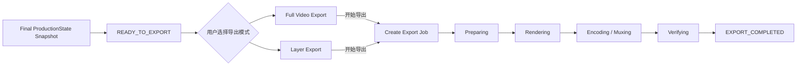
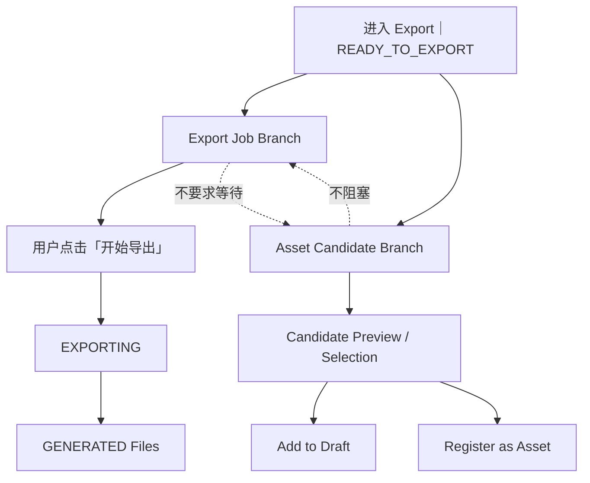
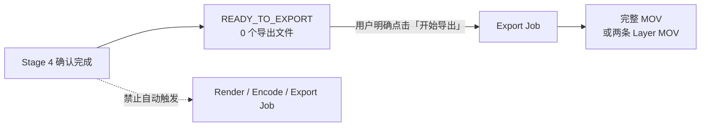

# AI DIRECTOR 导出 R3

> **产品：** AI DIRECTOR｜AI 视频导演工作台 / 视频生产线  
> **版本：** R3  
> **文档状态：** Frozen Baseline｜正式冻结基线  
> **基线版本：** 1.0  
> **最后确认：** 2026-09-19  
> **范围：** Export｜导出阶段产品合同、页面、状态机、真实 Render Progress、文件产物、Asset Candidate 沉淀与智能剪辑边界。

---

# 0｜文档身份

Export 是 R3 正式第 5 生命周期阶段：

```text
01 素材准备
02 内容理解
03 导演编排
04 智能剪辑
05 导出
```

它不是：

- 智能剪辑内部按钮；
- Workbench 附属 Render 功能；
- 普通 Topic；
- Asset Library 子页面。

本文已吸收当前有效的 R2 导出技术合同与 R3 最新 ToC 导出基线，研发无需读取 R2。

---

# 1｜最重要阶段边界【FROZEN】

智能剪辑完成：

```text
Production Completed / Pending Acceptance
→ 用户整片预览 / 参数化精调
→ 用户「确认完成」
→ Freeze Final ProductionState Snapshot
→ Enter Export
→ READY_TO_EXPORT
```

到这里：

> **仍然没有生成任何最终视频文件。**

进入 Export 页面不自动：

- Render；
- Encode；
- Mux；
- MP4 / MOV；
- Alpha MOV；
- Export Job。

只有用户在 Export 明确执行：

> **开始导出**

才创建 Export Job 并开始生成文件。


## 1.1｜导出阶段总流程图



## 1.2｜文件生成与 Asset Candidate 并行关系



## 1.3｜唯一文件生成边界



---

# 2｜Export 输入合同

进入 Export 时读取已冻结：

> **Final ProductionState Snapshot｜最终生产状态快照**

同时可读取：

- Base Video；
- Project Timebase；
- Selected Engine / Engine Adapter；
- 当前 Asset Candidates；
- 项目基本信息。

Export 不重新：

- 做导演决策；
- 做内容理解；
- 生成组件；
- 修改 Shot；
- 修改 Component；
- 运行 Production QA；
- 重新编译 ProductionState。

---

# 3｜只有两种导出模式

```text
Export
├─ Mode A｜Full Video Export｜完整成片导出
└─ Mode B｜Layer Export｜分层 MOV 导出
```

不存在第三种模式。

不提供：

- 按组件导出；
- 按素材导出；
- 按 Chapter 导出；
- 按 Director Shot 导出；
- Export All 作为第三模式。

---

# 4｜Mode A：Full Video Export

固定输出：

```text
1 × 完整 MOV
```

完整 MOV 包含最终确认 ProductionState 所需全部成片视觉结果：

- Base Video；
- 最终人物画面 / 人物呈现；
- 全部最终 Component Packaging；
- 启用的 Global Packaging；
- 最终人物布局与包装视觉；
- 当前项目正式成片所需视觉内容。

它是可以直接交付的完整成片，不要求用户再基础拼装。

---

# 5｜Mode B：Layer Export

固定输出两个文件：

```text
Motion Layer.mov
+
Character Layout Overlay.mov
```

## 5.1 Motion Layer.mov

包含：

- 内容组件；
- 组件动画；
- 数据 / 流程 / 图表；
- Subtitle / Chapter Progress 等最终包装；
- 当前最终 ProductionState 中属于 Motion Layer 的包装结果。

不包含：

- 人物本体；
- Base Video。

## 5.2 Character Layout Overlay.mov

包含：

- 人物框；
- 分屏边框；
- 头像框；
- 人物区域装饰；
- 人物布局切换相关视觉装饰。

不包含：

- 人物本体；
- Base Video。

## 5.3 两层一致性合同

两条 MOV 必须：

- Alpha 透明；
- 项目画幅一致；
- fps 一致；
- duration 一致；
- frame 0 对齐；
- 来自同一个 Final ProductionState Snapshot。

---

# 6｜Export Page 固定架构

```text
LEFT
Lifecycle Navigation

CENTER
├─ A. Final Export｜最终导出
└─ B. Asset Candidates｜候选资产

RIGHT
Film Dashboard｜成片仪表盘 Drawer
```

整个 Export 生命周期保持**同一页面**，不因状态切换重构页面。

---

# 7｜Left｜生命周期导航

```text
01 素材准备
02 内容理解
03 导演编排
04 智能剪辑
05 导出 ●
```

`05 导出` Active。

不在 Export 页面重新出现智能剪辑 Component Inspector。

---

# 8｜Center Top：Final Export

负责：

- 选择 Full Video / Layer Export；
- 用户明确开始导出；
- 展示 Export Job 状态；
- 展示真实进度；
- 展示完成状态。

在 `READY_TO_EXPORT`：

> **必须由用户点击“开始导出”。**

禁止页面进入后自动开始。

---

# 9｜Center Bottom：Asset Candidates

始终为：

> **Asset Candidates｜候选资产**

Candidate 与 Export Job 在业务上解耦：

```text
Video Export Job
≠
Asset Candidate Settlement
```

进入 Export 页面时 Candidate 已经可以完成筛选并展示，不需要等 Export Completed 后才出现。

---

# 10｜Right：Film Dashboard｜成片仪表盘

只读项目汇总。

固定四项：

```text
全片总时间
共 XX 章节 · XX 分镜
使用 XX 个组件卡片
已筛选 XX 个候选资产
```

分割线以下：

> **导出文件**

不承担：

- 导出模式配置；
- Component Inspector；
- Candidate Preview；
- Asset Library 编辑；
- Production 编辑；
- Export History。

---

# 11｜Export Page 状态机

主页面只冻结三状态：

```text
READY_TO_EXPORT
      ↓ 用户明确开始导出
EXPORTING
      ↓
EXPORT_COMPLETED
```

不增加第四个主页面状态。

---

# 12｜State 01：READY_TO_EXPORT

语义：

- 智能剪辑已经确认完成；
- Final ProductionState Snapshot 已锁定；
- Asset Candidates 已可显示；
- 尚未创建 Export Job；
- 尚未生成任何导出文件。

页面：

```text
Final Export

选择导出模式
[ 完整成片导出 ] [ 分层 MOV 导出 ]

[ 开始导出 ]

────────────────────

Asset Candidates
[Candidate] [Candidate] ...
```

Film Dashboard 文件区：

```text
尚未生成导出文件

点击“开始导出”后，
系统才会生成最终文件。
```

---

# 13｜创建 Export Job 的唯一入口

只有：

```text
READY_TO_EXPORT
→ 用户选择 Mode
→ 用户点击「开始导出」
→ Lock Current Export Mode
→ Create Export Job
→ EXPORTING
```

不得由以下事件隐式创建 Export Job：

- 智能剪辑 Job COMPLETED；
- “马上预览成片”；
- “确认完成”；
- 进入 Export 页面；
- Candidate 操作；
- 自动保存。

---

# 14｜State 02：EXPORTING

开始后：

- 当前导出模式锁定；
- 当前 Job 中不可切换模式；
- 展示真实进度；
- Candidate 区继续可见；
- Candidate 操作不阻塞 Render。

---

# 15｜真实 Export Progress

Export 可能持续数分钟，不得只显示 Spinner。

真实 Stage：

```text
Preparing
    ↓
Rendering
    ↓
Encoding / Muxing
    ↓
Verifying
    ↓
Completed
```

要求：

- Stage 文案来自真实 Job 状态；
- Rendering 百分比来自真实 Frame Progress；
- 同时展示 Frame Count；
- 展示 Elapsed Time；
- 不做虚假递增百分比；
- 视觉动画只表达后台真实状态。

例：

```text
正在导出

68%
███████████████░░░░░

正在渲染最终视频
3,021 / 4,440 frames
已用时间 02:14

Preparing → Rendering → Encoding/Muxing → Verifying → Completed
```

---

# 16｜Layer Export File Progress

Layer Export：

顶部保持一个整体 Job Progress。

下面只展示两个固定文件：

```text
整体 Export Job     68%

Motion Layer.mov
██████████████████ 100% ✓

Character Layout Overlay.mov
███████████░░░░░░ 63%
```

禁止继续拆到：

- Component；
- Material；
- Chapter；
- Shot。

文件级进度只是 Job 子信息，不形成第三种 Export Mode。

---

# 17｜Export Files 状态语义

文件区只有两种业务语义：

```text
BEFORE_GENERATED
        ↓
GENERATED
```

`EXPORTING` 是整个页面 / Job 状态，不是第三种文件结构。

因此：

- READY_TO_EXPORT：文件区占位；
- EXPORTING：仍是 BEFORE_GENERATED，可显示“文件生成中”；
- EXPORT_COMPLETED：GENERATED，显示真实文件名。

不建立临时文件列表 / Component 文件列表。

---

# 18｜State 03：EXPORT_COMPLETED

Final Export 区显示：

> **✓ 导出完成**

Film Dashboard 文件区：

### Full Video

```text
project-name.mov

[ 打开项目文件夹 ]
```

### Layer Export

```text
Motion Layer.mov
Character Layout Overlay.mov

[ 打开项目文件夹 ]
```

“打开项目文件夹”定位当前 Project Workspace 下的 `04_导出成片` 正式目录。所有最终导出文件只进入该目录；临时编码文件、Render Cache、日志与中间文件不得混入该目录。

---

# 19｜Asset Candidate Model

必须区分：

```text
Project DRAFT
≠ Asset Candidate
≠ Asset Library DRAFT
≠ REGISTERED
```

Candidate 已经：

- 在真实项目中生产；
- 最终采用；
- 经过当前项目 Production QA；
- 被筛选为潜在可复用能力。

但 Candidate 尚未进入长期资产库。

---

# 20｜Candidate 来源

当前 V1 进入候选：

- 新生成独立组件；
- 实际进入最终成片 ProductionState；
- 通过当前项目验证；
- 系统筛选为潜在复用能力。

不进入：

- Pure Reuse REGISTERED；
- Parametric Edit；
- Production Material；
- Internal Helper；
- Unused Generated Component。

V1 ToC 不开放 Structural Edit，因此不把“Registered 经 Structural Edit 形成新 Candidate Version”作为当前主要用户候选来源。

---

# 21｜Candidate Card

卡片只显示必要 ToC 信息：

- Static Thumbnail；
- Title；
- Description；
- Category；
- Status。

不显示：

- Component ID；
- Version；
- Props；
- Source Code；
- Source Shot；
- QA 内部字段。

---

# 22｜Candidate Preview

点击 Candidate：

> **当前 Export Page 上方 Overlay / Modal Preview。**

不离开 Export 页面，不新建生命周期页面。

固定：

- Live Component Preview；
- Title；
- Description；
- Category；
- Add to Draft；
- Register as Asset。

禁止：

- Inspector；
- Props Edit；
- Timeline；
- Layout Edit；
- Color Edit；
- Animation Edit；
- Structural Edit；
- Code Edit。

---

# 23｜Candidate Actions

只有两个正式动作：

## Add to Draft

```text
Asset Candidate
→ Add to Draft
→ Asset Library DRAFT
→ Component Draft Box
```

## Register as Asset

```text
Asset Candidate
→ Register as Asset
→ Normalize
→ Deterministic Registration QA
→ Auto-fix If Needed
→ PASS
→ REGISTERED
```

两个动作并列。

当前没有：

> `Ignore｜忽略`

不操作：

> Candidate 保持未处理。

---

# 24｜Multi-select

Candidate 支持多选。

批量操作只提供：

- 加入草稿；
- 注册为资产。

不提供：

- 批量删除；
- 批量重命名；
- 批量改分类；
- 批量 Props；
- 批量编辑。

---

# 25｜Candidate Settlement State

操作后 Candidate Card 不从当前项目消失。

状态：

- 已加入草稿；
- 已注册；
- 未处理。

可显示：

```text
候选资产 6
已注册 3 · 已加入草稿 2 · 未处理 1
```

用于记录本项目资产沉淀结果。

---

# 26｜Export Job × Candidate 解耦

冻结：

- 视频导出不等待资产注册；
- 资产注册不阻塞 Render；
- EXPORTING 时仍可处理 Candidate；
- Candidate 状态不改写 Final ProductionState Snapshot；
- Candidate 数量不影响视频文件结构；
- Candidate Settlement 不是文件生成步骤。

---

# 27｜Engine Boundary

业务层保持：

```text
Final ProductionState Snapshot
→ Engine Adapter
→ Selected Engine
→ Render / Encode / Verify
```

当前 V1 Primary Engine = HyperFrames；Remotion 为 Expansion Engine。

但 Export 产品合同不得绑定单一 Engine 实现。

历史 Remotion 技术验证不反向改变 Engine Independence。

---

# 28｜失败 / Retry 边界

当前 Frozen Baseline 不展开完整 ToC Failure UI，但工程必须保证：

- Export Job 失败不改变 Final ProductionState Snapshot；
- Asset Candidate 状态不丢失；
- 不因为 Render 失败回到 Stage 4 重新生产；
- Retry 应使用同一已锁定 Export Input，除非用户显式回到上游产生新的确认状态。

完整 Failure / Retry UI 属于后续 Delta。

---

# 29｜V1 不开放的 Export 高级能力

当前不做：

- Export History；
- 自定义复杂文件命名规则；
- fps 用户自由修改；
- codec 用户自由修改；
- bitrate 用户自由修改；
- 按组件 / 章节 / Shot 输出；
- Candidate 自动评分排序作为强业务逻辑；
- Export 页面重新编辑 ProductionState。

---

# 30｜Coding Contract

固定页面：

```text
ExportPage
│
├─ LEFT
│  └─ Lifecycle Navigation
│
├─ CENTER
│  ├─ Final Export
│  └─ Asset Candidates
│
└─ RIGHT
   └─ Film Dashboard Drawer
```

只允许状态变化：

```text
READY_TO_EXPORT
→ EXPORTING
→ EXPORT_COMPLETED
```

不得因状态变化：

- 隐藏 Candidate 区；
- 换第二页面；
- 重新出现 Component Inspector；
- 重新进入 Production；
- 把 Candidate 变成导出文件。

---

# 31｜Superseded Rules

以下旧语义失效：

1. 智能剪辑完成自动 Render。
2. 用户“确认完成”立即生成文件。
3. 进入 Export 页面自动创建 Export Job。
4. `Confirm Production → Export`。
5. Export 只是 Stage 4 附属按钮。
6. Export 只显示 Spinner / 假进度。
7. Export 右栏为 Confirmed Production + Export History。
8. Export Completed 后才发现 Candidate。
9. Candidate 有 Ignore Button。
10. Candidate 必须先 Draft 再 Register。

---

# 32｜Deterministic QA Checklist

## Stage Boundary

- [ ] Export 是第 5 生命周期节点。
- [ ] “确认完成”只进入 READY_TO_EXPORT。
- [ ] 进入 Export 不自动创建 Job。
- [ ] 只有“开始导出”创建 Job。

## Export Modes

- [ ] 只有 Full Video / Layer Export。
- [ ] Full Video = 1 MOV。
- [ ] Layer = 2 固定 Alpha MOV。
- [ ] 无 Chapter / Shot / Component 单独导出。

## Page

- [ ] 左中右固定骨架。
- [ ] Center 上 Export、下 Candidates。
- [ ] Right = 成片仪表盘。
- [ ] 三主状态正确。

## Progress

- [ ] 使用真实 Stage。
- [ ] Rendering 使用真实 Frame Progress。
- [ ] 显示 Elapsed Time。
- [ ] 无假百分比 / 单 Spinner 替代。
- [ ] Layer 模式显示两个固定文件进度。

## Files

- [ ] READY_TO_EXPORT 无文件。
- [ ] EXPORTING 文件区仍 BEFORE_GENERATED。
- [ ] COMPLETED 才展示文件名。
- [ ] 可打开项目文件夹。

## Candidate

- [ ] 进入 Export 时 Candidate 已可见。
- [ ] Candidate 与 Export Job 解耦。
- [ ] Preview 只读 Overlay / Modal。
- [ ] 只有 Add to Draft / Register。
- [ ] 无 Ignore。
- [ ] Multi-select 只有两种批量动作。
- [ ] 处理后 Card 保留状态。

---

# 33｜Frozen Invariants

1. Export 是独立 Stage 5。
2. Stage 4 生产完成不生成文件。
3. “确认完成”不生成文件。
4. 进入 Export 页面不创建 Export Job。
5. 只有用户明确“开始导出”才创建 Job。
6. 只有 Full Video / Layer Export 两种模式。
7. Full Video 固定 1 MOV。
8. Layer Export 固定 2 Alpha MOV。
9. 页面状态只有 READY_TO_EXPORT / EXPORTING / EXPORT_COMPLETED。
10. Export Progress 必须由真实 Job 状态驱动。
11. Candidate 在进入 Export 时即可展示。
12. Candidate Settlement 与文件 Render 解耦。
13. Candidate 只有 Add to Draft / Register as Asset。
14. 当前无 Ignore Button。
15. Export 不承担 Production / Production QA / Component Editing。
16. Final ProductionState Snapshot 是 Export 的生产事实输入。

---

# 34｜Baseline Effect

本文生效后，任何“智能剪辑任务完成即自动渲染 / 自动输出文件”“进入 Export 自动开始”“确认完成即 Render”的历史实现或文档语义均视为错误回退，必须按本文修正。
